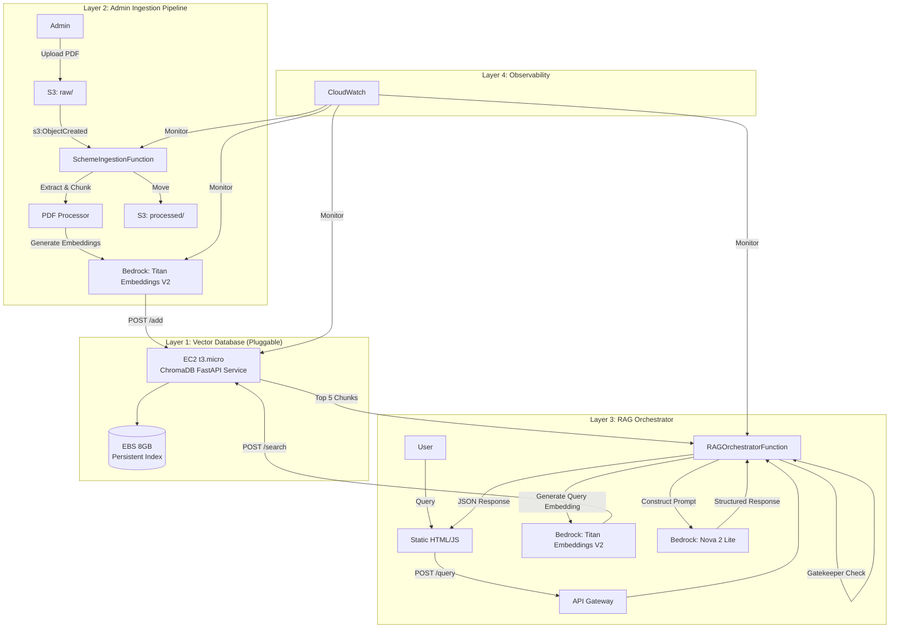
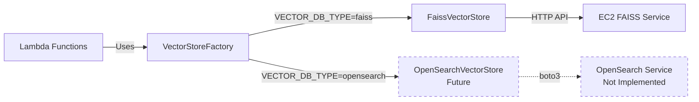
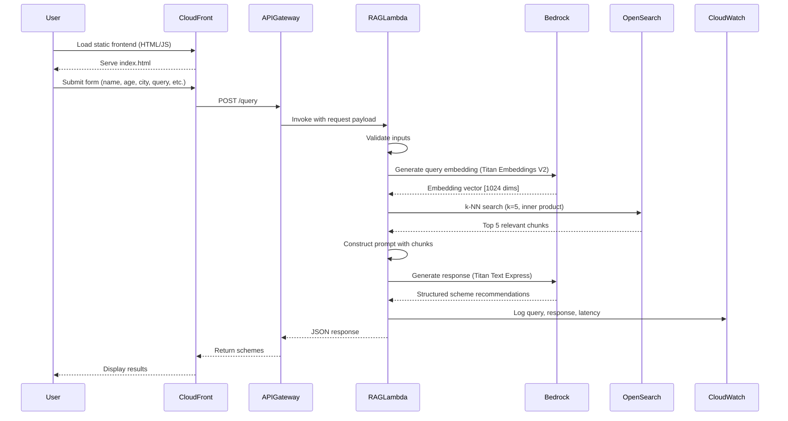
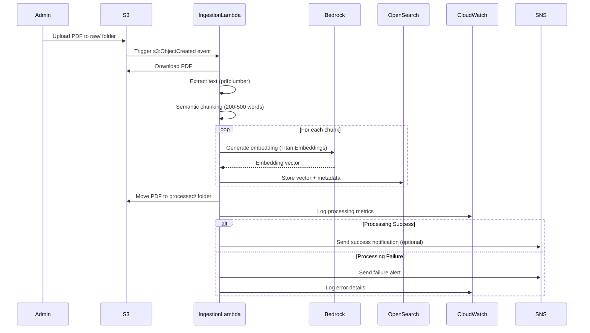
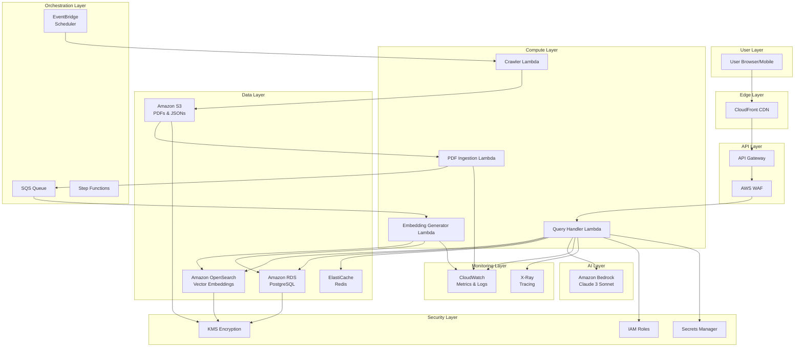

# Design Document: Multilingual Government Scheme Assistant

## Overview

The Multilingual Government Scheme Assistant is a hybrid serverless RAG-based AI system that helps rural Indian citizens discover government welfare schemes. The system uses AWS Lambda functions, Amazon Bedrock (Titan and Nova models), and ChromaDB vector database on EC2 to provide cost-effective, scalable scheme discovery with multilingual support.

The architecture follows a four-layer approach:
- **Layer 1 (Vector Database)**: ChromaDB on EC2 with FastAPI (pluggable architecture)
- **Layer 2 (Admin Ingestion)**: S3-triggered Lambda for automated PDF processing
- **Layer 3 (RAG Orchestrator)**: API Gateway + Lambda for user query handling
- **Layer 4 (Observability)**: CloudWatch for comprehensive monitoring

This design prioritizes **cost optimization for prototype**, **loosely coupled architecture** (easy migration to OpenSearch later), minimal data collection, and responsible AI practices. All resources are deployed in **ap-south-1 (Mumbai)** region.

**Key Design Decision**: ChromaDB on EC2 is the default vector database for prototype phase. The architecture uses a pluggable design allowing seamless migration to other vector databases in production without changing Lambda code.

## Why RAG is Central to This Architecture

Traditional approaches fail for government scheme discovery because:

1. **Rule-based systems cannot scale**: With hundreds of schemes across states, each with nuanced eligibility criteria, maintaining decision trees becomes impossible
2. **Keyword search fails across languages**: A farmer asking "खेती के लिए मदद" needs semantic understanding, not keyword matching
3. **Static databases become stale**: Schemes update frequently; RAG allows dynamic knowledge base updates without retraining models
4. **Context matters**: Eligibility terms like "small farmer" or "economically weaker section" require contextual interpretation

RAG solves these problems by:
- **Semantic retrieval**: Finding relevant schemes based on meaning, not keywords
- **Grounded generation**: LLM responses cite actual government documents, ensuring accuracy
- **Multilingual reasoning**: Embeddings capture semantic meaning across languages
- **Dynamic updates**: New schemes are added by updating the vector database, not retraining models

## Implementation Stages

The system is built in 9 structured development stages, allowing incremental development and testing:

**STAGE 1 — AWS Infrastructure Setup** (P0 Critical)
- Goal: AWS backbone ready
- Deliverable: S3 buckets, IAM roles, Bedrock access configured
- Status: ✅ Completed

**STAGE 2 — Frontend Deployment** (P1 Important)
- Goal: 3-page multilingual frontend deployed
- Deliverable: CloudFront URL serving language selection, form, and results pages
- Status: ✅ Completed

**STAGE 3 — ChromaDB Vector Service on EC2** (P0 Critical)
- Goal: ChromaDB API running on EC2
- Deliverable: FastAPI service with /add, /search, /health, /delete, /delete_all, /rebuild, /stats, /collections endpoints
- Status: ✅ Completed

**STAGE 4 — Ingestion Pipeline** (P0 Critical)
- Goal: PDF → chunks → embeddings → ChromaDB
- Deliverable: S3-triggered Lambda that processes PDFs and stores vectors in ChromaDB
- Status: ✅ Completed

**STAGE 5 — RAG Orchestrator** (P0 Critical)
- Goal: Query → embedding → ChromaDB → retrieved chunks → Bedrock
- Deliverable: API Gateway + Lambda that handles user queries and returns scheme recommendations
- Status: ✅ Completed

**STAGE 6 — Observability** (P1 Important)
- Goal: Basic monitoring for production readiness
- Deliverable: CloudWatch Logs Insights queries for debugging
- Status: ✅ Completed

**STAGE 7 — Response Persistence & PDF Export** (P2 Optional)
- Goal: S3 Storage + Download API
- Deliverable: Store query responses in S3 and provide PDF export functionality
- Status: ⏳ Future Scope

**STAGE 8 — Gatekeeper** (P1 Important)
- Goal: Similarity threshold check (ChromaDB results → check similarity → decide to call LLM or not)
- Deliverable: Logic to validate retrieval quality before invoking Bedrock LLM
- Status: ✅ Completed (integrated in RAG Orchestrator)

**STAGE 9 — Testing & Validation** (P0 Critical)
- Goal: End-to-end testing and validation
- Deliverable: Comprehensive test suite covering all components
- Status: ⏳ Pending

## Architecture

### High-Level Architecture (Hybrid Serverless with ChromaDB)



### Pluggable Vector Database Architecture



### Component Architecture

#### 1. Vector Database Layer (ChromaDB on EC2)

**EC2 ChromaDB Service**:
- **Instance Type**: t3.micro (free tier eligible, 1 vCPU, 1 GB RAM)
- **OS**: Ubuntu 24.04 LTS
- **Application**: FastAPI serving ChromaDB vector database
- **Storage**: 8 GB EBS gp3 volume (persistent index storage)
- **Availability**: 24/7 operation during evaluation period
- **Access**: Public IP with Security Group restrictions
- **Authentication**: API key at application level

**ChromaDB FastAPI Endpoints**:
- `POST /add` - Add documents with embeddings and metadata (including category, state, and eligibility fields)
- `POST /search` - k-NN similarity search (k=5) with pure vector search, metadata filtering applied post-retrieval
- `POST /delete` - Delete specific documents
- `GET /health` - Health check endpoint
- `GET /stats` - Collection statistics
- `POST /delete_all` - Delete all documents
- `POST /rebuild` - Rebuild index

**ChromaDB Configuration**:
- Collection name: `govt_schemes`
- Embedding dimension: 1024 (Titan Embeddings V2)
- Distance metric: Cosine similarity
- Persistent storage: `/chroma_data` directory on EBS

**Security**:
- EC2 Security Group: Allow inbound on port 8000 from anywhere (0.0.0.0/0) for prototype
- API Key authentication: `X-API-Key` header required
- HTTPS not required (internal AWS communication)
- CloudWatch logging for all API calls

**Persistence**:
- ChromaDB data persisted to `/chroma_data` on EBS
- Auto-load on FastAPI startup
- Auto-save after each add operation

#### 2. Frontend Layer (Static HTML/JS)

**Three-Page Application Architecture**:
- **Technology**: Static HTML + Vanilla JavaScript
- **Hosting**: Amazon S3 + CloudFront distribution
- **File Structure**: 
  - `index.html` - Language selection page (Page 1)
  - `form.html` - User input form (Page 2)
  - `results.html` - Results display (Page 3)
  - `app.js` - JavaScript with fetch() API calls
  - `translations.js` - Multilingual UI translations
  - `styles.css` - Minimal styling

**Page 1: Language Selection (index.html)**:
- Display 3 language tiles in a grid layout
- Languages: English (default), Hindi, Tamil
- Each tile is clickable and navigates to form.html with selected language
- Language selection stored in session storage
- All UI text on this page in English (default) with language names in native script

**Page 2: User Input Form (form.html)**:
- **Name** (text input, required)
- **Age** (number input, required, min=1, max=120)
- **State** (dropdown, required): All 36 Indian states and union territories
- **Gender** (dropdown, optional, after age): Male / Female / Other / Prefer not to say
- **Income Range** (dropdown, optional): Unemployed (0) / <1L / 1-3L / 3-5L / 5-10L / >10L
- **Category** (dropdown, required): 8 categories
  - Education & Skills (education_skill)
  - Startup and Self Employment (startup_selfemployment)
  - Agriculture (agriculture)
  - Health Care (healthcare)
  - Solar Subsidy (solar_subsidy)
  - Housing Aid (housing_aid)
  - Water & Sanitation (water_sanitation)
  - Other Schemes (others)
- **Query** (textarea, required): Free-text query about schemes in user's selected language
- **Submit Button**: Triggers POST /query to API Gateway, navigates to results.html
- **Reset Button**: Clears form
- **All UI elements** (labels, buttons, placeholders, error messages, dropdown options) displayed in selected language
- **API values**: Category and state values sent to API in English (snake_case) regardless of UI language
- **Multilingual query support**: User can type query in English, Hindi, or Tamil - no translation needed

**Page 3: Results Display (results.html)**:
- Scheme cards with name, eligibility, benefits, application steps
- Source citations with document links
- Confidence scores (High/Medium/Low)
- **PDF Download Button**: Generates and downloads PDF of results (Future Scope)
- **Back Button**: Returns to form.html for new search
- **All UI elements** displayed in selected language
- Error messages for failed requests in selected language

**Multilingual UI Support**:
- All labels, buttons, error messages, placeholders translated to selected language
- Translation files: `translations.js` with key-value pairs for each language
- Dynamic text replacement based on language selection
- Not just responses, but entire UI in user's preferred language

**Data Privacy**:
- NO collection of: Aadhaar, Bank details, DOB, Sensitive IDs
- All data sent via HTTPS
- No client-side storage of sensitive information

#### 3. API Layer (API Gateway + Lambda)

**API Gateway**:
- **Type**: HTTP API (simpler, cheaper than REST API)
- **Endpoint**: POST /query
- **CORS**: Enabled for CloudFront origin
- **Throttling**: 100 requests/second per IP
- **Integration**: Lambda proxy integration with RAGOrchestratorFunction
- **Authentication**: None (public access, rate-limited)
- **Logging**: Access logs to CloudWatch

**Request Format**:
```json
{
  "name": "string",
  "age": 25,
  "state": "tamil_nadu",
  "gender": "Male",
  "income_range": "3-5L",
  "category": "agriculture",
  "language": "Hindi",
  "query": "मुझे कृषि योजनाओं के बारे में बताएं"
}
```

**Note**: The `category` field is required and must be one of: education_skill, startup_selfemployment, agriculture, healthcare, solar_subsidy, housing_aid, water_sanitation, others. The `state` field is required and must be a valid Indian state/UT in snake_case format (e.g., tamil_nadu, andhra_pradesh, maharashtra).

**Response Format**:
```json
{
  "schemes": [
    {
      "scheme_name": "PM-KISAN",
      "eligibility": "Small farmers with <2 hectares",
      "benefits": "₹6000/year in 3 installments",
      "application_steps": "Visit pmkisan.gov.in...",
      "source": "PM-KISAN Guidelines 2024, Page 3",
      "confidence": "High"
    }
  ],
  "query_id": "uuid",
  "timestamp": "2024-03-15T10:30:00Z"
}
```

#### 3. API Layer (API Gateway + Lambda)

**API Gateway**:
- **Type**: HTTP API (simpler, cheaper than REST API)
- **Endpoint**: POST /query
- **CORS**: Enabled for CloudFront origin
- **Throttling**: 100 requests/second per IP
- **Integration**: Lambda proxy integration with RAGOrchestratorFunction
- **Authentication**: None (public access, rate-limited)
- **Logging**: Access logs to CloudWatch

**Request Format**:
```json
{
  "name": "string",
  "age": 25,
  "state": "tamil_nadu",
  "gender": "Male",
  "income_range": "3-5L",
  "category": "agriculture",
  "language": "Hindi",
  "query": "मुझे कृषि योजनाओं के बारे में बताएं"
}
```

**Note**: The `category` field is required and must be one of: education_skill, startup_selfemployment, agriculture, healthcare, solar_subsidy, housing_aid, water_sanitation, others. The `state` field is required and must be a valid Indian state/UT in snake_case format (e.g., tamil_nadu, andhra_pradesh, maharashtra).

**Response Format**:
```json
{
  "schemes": [
    {
      "scheme_name": "PM-KISAN",
      "eligibility": "Small farmers with <2 hectares",
      "benefits": "₹6000/year in 3 installments",
      "application_steps": "Visit pmkisan.gov.in...",
      "source": "PM-KISAN Guidelines 2024, Page 3",
      "confidence": "High"
    }
  ],
  "query_id": "uuid",
  "timestamp": "2024-03-15T10:30:00Z"
}
```

#### 4. Lambda Functions (Serverless Compute)

**SchemeIngestionFunction** (Layer 1):
- **Trigger**: S3 ObjectCreated event on `s3://aicloud-bharat-schemes/raw/`
- **Runtime**: Python 3.11
- **Memory**: 1024 MB
- **Timeout**: 5 minutes
- **Concurrency**: Reserved 5, Max 10
- **Environment Variables**:
  - `OPENSEARCH_ENDPOINT`: OpenSearch cluster endpoint
  - `INDEX_NAME`: govt-schemes-index
  - `BEDROCK_MODEL_ID`: amazon.titan-embed-text-v2:0
  - `S3_BUCKET`: aicloud-bharat-schemes

**Responsibilities**:
1. Download PDF from S3 `raw/` folder
2. Extract text using pdfplumber or PyMuPDF
3. Semantic chunking (200-500 words, 50-word overlap)
4. Generate embeddings via Bedrock Titan Embeddings
5. Store vectors in OpenSearch with metadata
6. Move processed PDF to `processed/` folder
7. Structured JSON logging to CloudWatch

**Idempotency**: Use S3 object key as idempotency token to prevent duplicate processing

**Error Handling**:
- Retry failed Bedrock calls (3 attempts with exponential backoff)
- Log errors to CloudWatch with PDF metadata
- Send SNS alert if processing fails after retries

---

**RAGOrchestratorFunction** (Layer 2):
- **Trigger**: API Gateway POST /query
- **Runtime**: Python 3.11
- **Memory**: 512 MB
- **Timeout**: 30 seconds
- **Concurrency**: Reserved 10, Max 20
- **Environment Variables**:
  - `VECTOR_DB_TYPE`: faiss
  - `FAISS_API_URL`: http://<EC2_PUBLIC_IP>:8000
  - `FAISS_API_KEY`: <generated_key>
  - `BEDROCK_EMBEDDING_MODEL`: amazon.titan-embed-text-v2:0
  - `BEDROCK_LLM_MODEL`: global.amazon.nova-2-lite-v1:0

**Responsibilities**:
1. Validate input (required fields: name, age, state, category, language, query)
2. Generate query embedding using Bedrock Titan Embeddings V2 (1024 dimensions)
3. Call FAISS API (POST /search) for k-NN search (k=5)
4. Apply category and state filtering: `(metadata.category == user_category) AND (metadata.state == user_state OR metadata.state == "all")`
5. If no results match filters, perform fallback search without category filtering
6. Construct enhanced prompt with user profile (age, gender, state, income_range, category) and retrieved chunks
7. Call Bedrock Nova 2 Lite for LLM generation with eligibility reasoning
8. Parse LLM response into structured JSON
9. Return schemes with eligibility, benefits, citations, confidence
10. Log query and response to CloudWatch

**Vector Store Usage**:
```python
from vectorstore.factory import VectorStoreFactory

vector_store = VectorStoreFactory.get_store()  # Returns FaissVectorStore
results = vector_store.search(query_embedding, top_k=5, category_filter=user_category, state_filter=user_state)
```

**Error Handling**:
- Return 400 for invalid input
- Return 500 for internal errors (Bedrock, FAISS API failures)
- Implement circuit breaker for Bedrock (open after 5 failures)
- Graceful degradation: Return basic scheme info if LLM fails

#### 4. Lambda Functions (Serverless Compute)

**SchemeIngestionFunction** (Layer 2):
- **Trigger**: S3 ObjectCreated event on `s3://aicloud-bharat-schemes/raw/`
- **Runtime**: Python 3.11
- **Memory**: 1024 MB
- **Timeout**: 5 minutes
- **Concurrency**: Reserved 5, Max 10
- **Environment Variables**:
  - `VECTOR_DB_TYPE`: faiss
  - `FAISS_API_URL`: http://<EC2_PUBLIC_IP>:8000
  - `FAISS_API_KEY`: <generated_key>
  - `BEDROCK_MODEL_ID`: amazon.titan-embed-text-v2:0
  - `S3_BUCKET`: aicloud-bharat-schemes

**Responsibilities**:
1. Download PDF from S3 `raw/` folder
2. Extract text using pdfplumber or PyMuPDF
3. Semantic chunking (200-500 words, 50-word overlap)
4. Generate embeddings via Bedrock Titan Embeddings
5. Call FAISS API (POST /add) to store vectors
6. Move processed PDF to `processed/` folder
7. Structured JSON logging to CloudWatch

**Vector Store Usage**:
```python
from vectorstore.factory import VectorStoreFactory

vector_store = VectorStoreFactory.get_store()  # Returns FaissVectorStore
vector_store.add_documents(chunks, embeddings, metadata)
```

**Idempotency**: Use S3 object key as idempotency token to prevent duplicate processing

**Error Handling**:
- Retry failed Bedrock calls (3 attempts with exponential backoff)
- Retry failed FAISS API calls (3 attempts)
- Log errors to CloudWatch with PDF metadata
- Send SNS alert if processing fails after retries

---

**RAGOrchestratorFunction** (Layer 3):
- **Trigger**: API Gateway POST /query
- **Runtime**: Python 3.11
- **Memory**: 512 MB
- **Timeout**: 30 seconds
- **Concurrency**: Reserved 10, Max 20
- **Environment Variables**:
  - `VECTOR_DB_TYPE`: faiss
  - `FAISS_API_URL`: http://<EC2_PUBLIC_IP>:8000
  - `FAISS_API_KEY`: <generated_key>
  - `BEDROCK_EMBEDDING_MODEL`: amazon.titan-embed-text-v2:0
  - `BEDROCK_LLM_MODEL`: global.amazon.nova-2-lite-v1:0

**Responsibilities**:
1. Validate input (required fields: name, age, state, category, language, query)
2. Generate query embedding using Bedrock Titan Embeddings V2 (1024 dimensions)
3. Call FAISS API (POST /search) for k-NN search (k=5)
4. Apply category and state filtering: `(metadata.category == user_category) AND (metadata.state == user_state OR metadata.state == "all")`
5. If no results match filters, perform fallback search without category filtering
6. Construct enhanced prompt with user profile (age, gender, state, income_range, category) and retrieved chunks
7. Call Bedrock Nova 2 Lite for LLM generation with eligibility reasoning
8. Parse LLM response into structured JSON
9. Return schemes with eligibility, benefits, citations, confidence
10. Log query and response to CloudWatch

**Vector Store Usage**:
```python
from vectorstore.factory import VectorStoreFactory

vector_store = VectorStoreFactory.get_store()  # Returns FaissVectorStore
results = vector_store.search(query_embedding, top_k=5, category_filter=user_category, state_filter=user_state)
```

**Error Handling**:
- Return 400 for invalid input
- Return 500 for internal errors (Bedrock, FAISS API failures)
- Implement circuit breaker for Bedrock (open after 5 failures)
- Graceful degradation: Return basic scheme info if LLM fails

#### 5. Data Layer

**Amazon OpenSearch Service** (Provisioned Cluster):
- **Deployment**: 3-node cluster (1 master, 2 data nodes)
- **Instance Type**: r6g.large.search (16 GB RAM, 2 vCPU)
- **Storage**: 100 GB EBS per node (gp3)
- **Access**: Public endpoint with IAM authentication + Fine-Grained Access Control
- **Encryption**: At-rest (AWS KMS), In-transit (TLS 1.2)
- **Index Name**: govt-schemes-index
- **k-NN Plugin**: Enabled for vector similarity search
- **Embedding Dimension**: 1024 (Titan Embeddings V2)
- **Similarity Metric**: Inner product (IP)

**Index Mapping**:
```json
{
  "mappings": {
    "properties": {
      "scheme_id": {"type": "keyword"},
      "scheme_name": {"type": "text"},
      "chunk_text": {"type": "text"},
      "chunk_index": {"type": "integer"},
      "department": {"type": "keyword"},
      "state": {"type": "keyword"},
      "city": {"type": "keyword"},
      "source_url": {"type": "keyword"},
      "last_updated": {"type": "date"},
      "embedding": {
        "type": "knn_vector",
        "dimension": 1024,
        "method": {
          "name": "hnsw",
          "space_type": "cosinesimil",
          "engine": "nmslib"
        }
      }
    }
  }
}
```

**S3 Storage**:
- **Bucket**: aicloud-bharat-schemes
- **Region**: ap-south-1
- **Folders**: 
  - `raw/` - Uploaded PDFs (triggers Lambda)
  - `processed/` - Successfully processed PDFs
  - `download/` - Generated PDF exports (Future Scope)
- **Versioning**: Disabled (cost optimization)
- **Encryption**: SSE-S3 (server-side encryption)
- **Access**: IAM role-based (no bucket policies)
- **Lifecycle**: Archive to Glacier after 90 days (optional)

#### 5. Data Layer

**FAISS Vector Index** (on EC2):
- **Storage**: Local file system on EBS volume (`/data/faiss_index.bin`)
- **Embedding Dimension**: 1024 (Titan Embeddings V2)
- **Similarity Metric**: Inner product (IP)
- **Index Type**: IndexFlatIP(1024) (inner product for 1024-dimensional vectors)
- **Metadata Storage**: JSON file (`/data/metadata.json`)
- **Persistence**: Auto-save after each add operation, auto-load on startup

**Metadata Structure**:
```json
{
  "doc_id_0": {
    "scheme_id": "pm-kisan-2024",
    "scheme_name": "PM-KISAN",
    "category": "agriculture",
    "state": "all",
    "chunk_text": "...",
    "chunk_index": 0,
    "department": "Ministry of Agriculture",
    "source_url": "https://pmkisan.gov.in/...",
    "last_updated": "2024-03-15"
  },
  "doc_id_1": {
    "scheme_id": "tn-solar-2024",
    "scheme_name": "Tamil Nadu Solar Rooftop Subsidy",
    "category": "solar_subsidy",
    "state": "tamil_nadu",
    "chunk_text": "...",
    "chunk_index": 0,
    "department": "Tamil Nadu Energy Department",
    "source_url": "https://teda.in/...",
    "last_updated": "2024-03-15"
  }
}
```

**State Field Logic**:
- Central/pan-India schemes: `state = "all"`
- State-specific schemes: `state = "<state_name>"` (e.g., "tamil_nadu", "karnataka")
- Filtering: `(state == user_state OR state == "all")`

**Category Field Values**:
Must be one of 8 predefined categories:
- education_skill
- startup_selfemployment
- agriculture
- healthcare
- solar_subsidy
- housing_aid
- water_sanitation
- others

**S3 Storage**:
- **Bucket**: aicloud-bharat-schemes
- **Region**: ap-south-1
- **Folders**: 
  - `raw/` - Uploaded PDFs (triggers Lambda)
  - `processed/` - Successfully processed PDFs
  - `download/` - Generated PDF exports (Future Scope)
- **Versioning**: Disabled (cost optimization)
- **Encryption**: SSE-S3 (server-side encryption)
- **Access**: IAM role-based (no bucket policies)
- **Lifecycle**: Archive to Glacier after 90 days (optional)

#### 6. Ingestion Pipeline (Event-Driven)

**S3 Event Trigger**:
- Event type: `s3:ObjectCreated:*`
- Prefix filter: `raw/`
- Suffix filter: `.pdf`
- Target: SchemeIngestionFunction Lambda

**PDF Processing Flow**:
1. Admin uploads PDF to `s3://aicloud-bharat-schemes/raw/scheme-name.pdf`
2. S3 triggers SchemeIngestionFunction Lambda
3. Lambda downloads PDF and extracts text
4. Text is chunked semantically (200-500 words)
5. Each chunk is embedded using Bedrock Titan Embeddings
6. Embeddings stored in OpenSearch with metadata
7. Original PDF moved to `processed/` folder
8. CloudWatch logs capture processing metrics

**Chunking Strategy**:
- Chunk size: 200-500 words
- Overlap: 50 words between consecutive chunks
- Preserve sentence boundaries (no mid-sentence splits)
- Include section headers in each chunk for context
- Metadata: scheme_id, chunk_index, department, state, city

**Idempotency**:
- Use S3 object key as idempotency token
- Check if scheme_id already exists in OpenSearch
- Skip processing if already indexed (unless force re-index flag set)
- Prevents duplicate processing on S3 event retries

#### 6. Ingestion Pipeline (Event-Driven)

**S3 Event Trigger**:
- Event type: `s3:ObjectCreated:*`
- Prefix filter: `raw/`
- Suffix filter: `.pdf`
- Target: SchemeIngestionFunction Lambda

**PDF Processing Flow**:
1. Admin uploads PDF to `s3://aicloud-bharat-schemes/raw/scheme-name.pdf`
2. S3 triggers SchemeIngestionFunction Lambda
3. Lambda downloads PDF and extracts text
4. Text is chunked using token-based splitting (700 tokens, 120 token overlap)
5. Each chunk is embedded using Bedrock Titan Embeddings V2 (amazon.titan-embed-text-v2:0, 1024 dimensions)
6. Embeddings sent to FAISS API (POST /add) with metadata
7. Original PDF moved to `processed/` folder
8. CloudWatch logs capture processing metrics

**Chunking Strategy**:
- Chunk size: 700 tokens
- Overlap: 120 tokens between consecutive chunks
- Preserve sentence boundaries (no mid-sentence splits)
- Include section headers in each chunk for context
- Metadata: scheme_id, scheme_name, category, state, chunk_index, department, source_url

**Metadata Structure**:
Each chunk includes enhanced metadata for precise filtering:
```json
{
  "scheme_name": "PM Surya Ghar Solar Subsidy",
  "category": "solar_subsidy",
  "state": "all",
  "chunk_text": "...",
  "chunk_index": 0,
  "department": "Ministry of New and Renewable Energy",
  "source_url": "https://pmsuryaghar.gov.in/...",
  "last_updated": "2024-03-15"
}
```

**State Field Values**:
- For central/pan-India schemes: `state = "all"`
- For state-specific schemes: `state = "<state_name>"` (e.g., "tamil_nadu", "andhra_pradesh")
- Enables filtering logic: `(state == user_state OR state == "all")`

**Category Field Values**:
Must be one of 8 predefined categories:
- education_skill
- startup_selfemployment
- agriculture
- healthcare
- solar_subsidy
- housing_aid
- water_sanitation
- others

**Idempotency**:
- Use S3 object key as idempotency token
- Check if scheme_id already exists in FAISS (via metadata)
- Skip processing if already indexed (unless force re-index flag set)
- Prevents duplicate processing on S3 event retries

#### 7. Observability Layer (CloudWatch)


**Note on CloudWatch Monitoring**: CloudWatch monitors backend services only (Lambda functions, API Gateway, EC2 FAISS service). Frontend errors and client-side issues are handled in the browser console and not logged to CloudWatch. User-facing error messages are displayed in the selected language on the frontend.

**Lambda Monitoring**:
- **Metrics**: Invocations, Errors, Duration, Throttles, Concurrent Executions
- **Alarms**:
  - Error rate > 5% (5-minute window)
  - Duration > 25 seconds (approaching timeout)
  - Throttles > 10 (concurrency limit reached)
- **Logs**: Structured JSON logs with request_id, user_state, query, response_time
- **Log Retention**: 30 days (cost optimization)

**API Gateway Monitoring**:
- **Metrics**: 4XX errors, 5XX errors, Latency, Request Count
- **Alarms**:
  - 5XX error rate > 2%
  - Latency p95 > 3 seconds
  - Request count > 1000/minute (DDoS detection)
- **Access Logs**: Enabled, stored in CloudWatch Logs

**OpenSearch Monitoring**:
- **Metrics**: CPU utilization, JVM memory pressure, Cluster health, Search latency
- **Alarms**:
  - CPU > 80% (5-minute window)
  - JVM memory pressure > 85%
  - Cluster health != green
  - Search latency p95 > 500ms
- **Slow Query Logs**: Enabled for queries > 1 second

**Bedrock Monitoring**:
- **Metrics**: Invocation count, Latency, Throttles, Model errors
- **Alarms**:
  - Throttle rate > 5%
  - Error rate > 3%
  - Latency p95 > 2 seconds
- **Cost Tracking**: Token usage per model (embeddings vs. LLM)

**Security Monitoring**:
- **CloudTrail**: Enabled for API calls (IAM, S3, OpenSearch, Bedrock)
- **GuardDuty**: Optional for threat detection
- **Alarms**:
  - Unauthorized access attempts
  - Unusual API call patterns
  - Failed authentication attempts > 10/minute

**Cost Monitoring**:
- **AWS Budgets**: Set budget alerts at 50%, 80%, 100% of monthly budget
- **Cost Allocation Tags**: Tag all resources with Project=GovtSchemeRAG
- **Cost Dashboard**: Track costs by service (Lambda, OpenSearch, Bedrock, S3)

## Data Flow

### End-to-End User Query Flow (Lambda-Based)



### Ingestion Pipeline Flow (Event-Driven)



## Multilingual Processing Architecture

### Language Support Strategy

The system supports 3 Indian languages: English (default), Hindi, and Tamil.

**Multilingual Embedding Model**:
- Amazon Bedrock Titan Embeddings V2 (amazon.titan-embed-text-v2:0)
- Produces 1024-dimensional embeddings
- Natively supports multilingual semantic understanding
- Query in Hindi can match schemes in English or Tamil
- No need for explicit translation layer

**LLM Multilingual Generation**:
- Amazon Bedrock Nova 2 Lite (global.amazon.nova-2-lite-v1:0)
- Native multilingual support for English, Hindi, and Tamil
- Prompt engineering to ensure output in user's preferred language
- System prompt includes language instruction: "Respond in English" (or "Hindi", "Tamil")
- ISO language code converted to full language name before prompt construction
- No translation service required - Nova 2 Lite generates directly in target language

**Language Selection**:
- User explicitly selects language on Page 1 (Language Selection page)
- Language preference stored in session storage
- All UI elements (labels, buttons, dropdowns) displayed in selected language
- User can type query in any of the 3 supported languages

**No Translation Service Needed**:
- Titan V2 embeddings handle multilingual queries natively
- Nova 2 Lite generates responses directly in user's selected language
- Eliminates need for separate translation API
- Reduces latency and cost

### Handling Code-Switching

Rural users often mix languages (e.g., Hindi-English). The system handles this by:
- Titan V2 embeddings naturally handle mixed-language queries
- Nova 2 Lite interprets mixed-language input contextually
- Response language follows user's preference setting, not input language

## Detailed RAG Workflow

### 1. Document Chunking Strategy

**Token-Based Chunking**:
- Split documents using token-based splitting (not word-based)
- Chunk size: 700 tokens
- Overlap: 120 tokens between consecutive chunks to maintain continuity
- Preserve sentence boundaries (no mid-sentence splits)
- Include section headers in each chunk for context

**Chunk Metadata**:
Each chunk includes:
- scheme_id: Unique identifier for the scheme
- scheme_name: Full name of the scheme
- category: One of 8 predefined categories (education_skill, startup_selfemployment, agriculture, healthcare, solar_subsidy, housing_aid, water_sanitation, others)
- state: State applicability ("all" for central schemes, or specific state like "tamil_nadu")
- chunk_index: Position in the document
- department: Ministry or department name
- source_url: Original PDF URL
- last_updated: Last update timestamp

### 2. Embedding Generation

**Model Selection**:
- Amazon Bedrock Titan Embeddings V2 (amazon.titan-embed-text-v2:0)
- 1024 dimensions
- Native multilingual support for English, Hindi, Tamil
- Optimized for semantic search

**Embedding Process**:
1. Normalize text (remove extra whitespace, preserve structure)
2. Generate embedding via Bedrock API
3. Store 1024-dimensional embedding vector in FAISS with metadata

**Query Embedding**:
1. User submits query in their selected language (English, Hindi, or Tamil)
2. Generate query embedding using Titan V2 (same model as document embeddings)
3. Use embedding for k-NN similarity search in FAISS

### 3. Retrieval Strategy

**Vector Search with Metadata Filtering**:
- Similarity metric: Inner product (IP) using IndexFlatIP(1024)
- Top-k: Retrieve top 5 most relevant chunks
- Category filtering: `metadata.category == user_category`
- State filtering: `metadata.state == user_state OR metadata.state == "all"`
- Combined filter: `(category == user_category) AND (state == user_state OR state == "all")`

**Filtering Logic**:
1. User selects category (e.g., "agriculture") and state (e.g., "tamil_nadu")
2. Vector search retrieves chunks matching: `category == "agriculture" AND (state == "tamil_nadu" OR state == "all")`
3. This returns:
   - Tamil Nadu agriculture schemes
   - Central/pan-India agriculture schemes
4. Excludes:
   - Karnataka agriculture schemes
   - Tamil Nadu solar schemes

**Fallback Mechanism**:
- If no results match category + state filters (similarity score < 0.4), perform fallback search
- Fallback: Search without category filtering, only state filtering
- If still no results, return "No relevant schemes found" message
- Never return results below 0.4 similarity threshold

**Top-k Selection**:
- Retrieve exactly top 5 chunks (not 10 or 20)
- Ensures focused context for LLM
- Reduces noise and improves response quality
- Avoids returning multiple chunks from same scheme (handled by metadata filtering)

### 4. Re-ranking

**No Cross-Encoder Re-ranking**:
- Simplified architecture: No additional re-ranking step
- Vector search with metadata filtering provides sufficient precision
- Top 5 chunks sent directly to LLM
- Reduces latency and complexity

**Geographic Prioritization**:
- State-specific schemes automatically prioritized through filtering logic
- Schemes with `state == user_state` appear alongside `state == "all"` schemes
- Boost schemes applicable to user's city by 1.5x
- Ensures local schemes appear before national schemes

**Recency Boosting**:
- Boost schemes updated in last 6 months by 1.1x
- Ensures users see current schemes first

### 5. LLM Generation

**Prompt Structure**:
```
System: You are a helpful assistant explaining government schemes to rural Indian citizens. 
Respond in English. Use simple vocabulary suitable for users with basic literacy.

User Profile:
- Age: {age}
- Gender: {gender}
- State: {state}
- Income Range: {income_range}
- Category: {category}

Context: [Top 5 retrieved chunks with metadata including scheme_name, category, state]

User Query: {user_query}

Instructions:
1. List relevant schemes with names and brief descriptions
2. Explain eligibility criteria in simple terms, considering the user's profile
3. Explain WHY the user may qualify for each scheme based on their age, state, income, and category
4. Describe key benefits in clear language
5. Provide application steps with official links
6. Cite source documents with page numbers
7. If uncertain, explicitly state "Please contact local officials for confirmation"
8. Provide confidence score (High/Medium/Low) for each scheme based on profile match

Output Format:
Scheme 1: [Name]
- Why you may qualify: [Explain based on user profile]
- Eligibility: [Full criteria]
- Benefits: [Key benefits]
- How to Apply: [Steps and links]
- Source: [Document name, Page X]
- Confidence: High/Medium/Low

[Repeat for each relevant scheme]
```

**Enhanced Prompt Features**:
- Includes user profile (age, gender, state, income_range, category) for personalized reasoning
- Instructs LLM to explain eligibility reasoning ("Why you may qualify")
- Uses top 5 chunks (not 10) for focused context
- Metadata includes scheme_name, category, state for precise filtering
- Confidence scores based on profile match, not just retrieval relevance

**Output Parsing**:
- Extract structured data from LLM response
- Validate presence of required fields (name, eligibility reasoning, benefits, application, source)
- Verify confidence scores are High/Medium/Low
- Format for UI display in user's selected language

## Technology Stack (Hybrid Serverless)

### Compute
- **Lambda Functions**: Python 3.11 runtime
  - SchemeIngestionFunction (1024 MB, 5 min timeout)
  - RAGOrchestratorFunction (512 MB, 30 sec timeout)
- **EC2**: t3.micro (1 vCPU, 1 GB RAM, free tier eligible)
  - FastAPI application serving FAISS
  - Ubuntu 22.04 LTS
  - 24/7 operation
- **Concurrency Limits**: Reserved 10-20, Max 20-50 per Lambda function

### Storage
- **Vector Database**: FAISS on EC2 (pluggable architecture)
- **EBS Volume**: 8 GB gp3 (persistent FAISS index storage)
- **PDF Storage**: Amazon S3 (aicloud-bharat-schemes bucket)
- **Static Frontend**: Static HTML/JS (3-page flow: Language Selection → User Input Form → Results Display) hosted on S3 + CloudFront

### AI/ML Services
- **Embeddings**: Amazon Bedrock - amazon.titan-embed-text-v2:0 (1024 dimensions)
- **LLM**: Amazon Bedrock - global.amazon.nova-2-lite-v1:0 (Nova 2 Lite)

### API & Networking
- **API Gateway**: HTTP API (POST /query endpoint)
- **CDN**: Amazon CloudFront for frontend distribution
- **VPC**: Non-VPC Lambda (public FAISS API with API key auth)
- **Security**: HTTPS for frontend, HTTP for internal Lambda↔EC2, Security Groups

### Monitoring & Logging
- **Metrics**: Amazon CloudWatch
- **Logging**: CloudWatch Logs (30-day retention)
- **Alarms**: SNS notifications for critical alerts
- **Audit**: CloudTrail for API call logging (optional)

### Cost Optimization (Free Tier Maximization)
- **EC2 t3.micro**: Free tier (750 hours/month)
- **EBS 8 GB**: Free tier (30 GB available)
- **Lambda**: Free tier (1M requests, 400K GB-seconds)
- **API Gateway**: Free tier (1M requests)
- **S3**: Free tier (5 GB storage, 20K GET requests)
- **CloudFront**: Free tier (1 TB transfer, 10M requests)
- **Estimated Monthly Cost**: $5-10 (only Bedrock usage)

### Region
- **All Resources**: ap-south-1 (Asia Pacific - Mumbai)

## IAM Roles and Policies

### SchemeIngestionFunction Lambda Role

**Role Name**: `SchemeIngestionLambdaRole`

**Trust Policy**:
```json
{
  "Version": "2012-10-17",
  "Statement": [{
    "Effect": "Allow",
    "Principal": {"Service": "lambda.amazonaws.com"},
    "Action": "sts:AssumeRole"
  }]
}
```

**Attached Policies**:

1. **S3 Access Policy** (Inline):
```json
{
  "Version": "2012-10-17",
  "Statement": [
    {
      "Effect": "Allow",
      "Action": [
        "s3:GetObject",
        "s3:PutObject",
        "s3:DeleteObject"
      ],
      "Resource": "arn:aws:s3:::aicloud-bharat-schemes/*"
    },
    {
      "Effect": "Allow",
      "Action": "s3:ListBucket",
      "Resource": "arn:aws:s3:::aicloud-bharat-schemes"
    }
  ]
}
```

2. **Bedrock Access Policy** (Inline):
```json
{
  "Version": "2012-10-17",
  "Statement": [{
    "Effect": "Allow",
    "Action": "bedrock:InvokeModel",
    "Resource": "arn:aws:bedrock:ap-south-1::foundation-model/amazon.titan-embed-text-v2:0"
  }]
}
```

3. **OpenSearch Access Policy** (Inline):
```json
{
  "Version": "2012-10-17",
  "Statement": [{
    "Effect": "Allow",
    "Action": [
      "es:ESHttpPut",
      "es:ESHttpPost",
      "es:ESHttpGet"
    ],
    "Resource": "arn:aws:es:ap-south-1:ACCOUNT_ID:domain/govt-schemes-cluster/*"
  }]
}
```

4. **CloudWatch Logs Policy** (AWS Managed):
- `arn:aws:iam::aws:policy/service-role/AWSLambdaBasicExecutionRole`

---

### RAGOrchestratorFunction Lambda Role

**Role Name**: `RAGOrchestratorLambdaRole`

**Trust Policy**: Same as above

**Attached Policies**:

1. **Bedrock Access Policy** (Inline):
```json
{
  "Version": "2012-10-17",
  "Statement": [
    {
      "Effect": "Allow",
      "Action": "bedrock:InvokeModel",
      "Resource": [
        "arn:aws:bedrock:ap-south-1::foundation-model/amazon.titan-embed-text-v2:0",
        "arn:aws:bedrock:*::foundation-model/global.amazon.nova-2-lite-v1:0"
      ]
    }
  ]
}
```

2. **OpenSearch Access Policy** (Inline):
```json
{
  "Version": "2012-10-17",
  "Statement": [{
    "Effect": "Allow",
    "Action": [
      "es:ESHttpGet",
      "es:ESHttpPost"
    ],
    "Resource": "arn:aws:es:ap-south-1:ACCOUNT_ID:domain/govt-schemes-cluster/*"
  }]
}
```

3. **CloudWatch Logs Policy** (AWS Managed):
- `arn:aws:iam::aws:policy/service-role/AWSLambdaBasicExecutionRole`

---

### OpenSearch Fine-Grained Access Control

**Master User**: IAM role-based (not internal database)

**Access Policy**:
```json
{
  "Version": "2012-10-17",
  "Statement": [
    {
      "Effect": "Allow",
      "Principal": {
        "AWS": [
          "arn:aws:iam::ACCOUNT_ID:role/SchemeIngestionLambdaRole",
          "arn:aws:iam::ACCOUNT_ID:role/RAGOrchestratorLambdaRole"
        ]
      },
      "Action": "es:*",
      "Resource": "arn:aws:es:ap-south-1:ACCOUNT_ID:domain/govt-schemes-cluster/*"
    }
  ]
}
```

## Scalability and Performance Design

### Horizontal Scaling (Serverless)

**Lambda Auto-Scaling**:
- Automatic scaling based on incoming requests
- Reserved concurrency: 10-20 per function (prevents runaway costs)
- Max concurrency: 20-50 per function (prevents account-level throttling)
- Cold start optimization: Keep functions warm with CloudWatch Events (optional)
- Provisioned concurrency: Not used initially (cost optimization)

**OpenSearch Cluster Scaling**:
- Initial: 3-node cluster (1 master, 2 data nodes)
- Vertical scaling: Upgrade to r6g.xlarge if CPU > 80% sustained
- Horizontal scaling: Add data nodes if storage > 70% or query latency increases
- Read replicas: Add replica shards for read-heavy workloads
- Auto-scaling: Not available for provisioned clusters (manual scaling)

**API Gateway Scaling**:
- Automatic scaling (no configuration needed)
- Throttling limits: 100 requests/second per IP
- Burst capacity: 200 requests (2x steady-state)
- Regional endpoint (not edge-optimized) for lower latency in India

### Performance Optimizations

**Lambda Optimizations**:
- Use Python 3.11 (faster startup than 3.9/3.10)
- Minimize package size (use Lambda layers for dependencies)
- Reuse connections (OpenSearch, Bedrock clients) across invocations
- Implement connection pooling for OpenSearch
- Use environment variables for configuration (no runtime lookups)

**OpenSearch Optimizations**:
- Use r6g instances (ARM-based, better price/performance)
- Enable UltraWarm for infrequently accessed data (cost savings)
- Optimize index settings: 1 primary shard, 1 replica shard
- Use index templates for consistent mapping
- Enable slow query logs (> 1 second) for optimization

**Bedrock Optimizations**:
- Batch embedding requests when possible (up to 25 texts per call)
- Use smaller prompts for LLM (reduce input tokens)
- Implement prompt caching (reuse system prompts)
- Set appropriate max_tokens (2048 for explanations)
- Use temperature=0.3 for consistent outputs

**CloudFront Caching**:
- Cache static assets (HTML, JS, CSS) for 24 hours
- Enable compression (gzip, brotli)
- Use regional edge caches for India
- Set appropriate cache-control headers

### Performance Targets

- **Query Latency**: <3 seconds (p95)
- **Vector Search**: <500ms (p95)
- **LLM Generation**: <2 seconds (p95)
- **Throughput**: 1000 concurrent users
- **Availability**: 99.9% uptime

## Security and Privacy Architecture

### Data Protection

**Encryption**:
- At Rest: AES-256 encryption for S3, RDS, and OpenSearch
- In Transit: TLS 1.3 for all API communications
- Key Management: AWS KMS for encryption key rotation

**Minimal Data Collection**:
- Required: city, language, communication mode, department
- Optional: age, gender, education (only when needed for eligibility)
- No PII storage: No names, phone numbers, addresses, or IDs
- Session data: Cleared after 30 minutes of inactivity

**Anonymization**:
- All logs anonymized (no IP addresses stored)
- Query logs hashed for analytics
- Audit logs contain only non-identifiable metadata

### Access Control

**API Security**:
- Rate limiting: 100 requests/minute per IP
- DDoS protection via AWS WAF
- CORS policy: Whitelist approved domains only
- No authentication required for basic search (anonymous access)

**Internal Services**:
- VPC isolation for databases and internal services
- Security groups: Least privilege access
- IAM roles: Service-specific permissions
- Secrets Manager: API keys and credentials

### Compliance

**Data Residency**:
- All data stored in AWS India regions (Mumbai, Hyderabad)
- No cross-border data transfer

**Privacy Regulations**:
- Compliant with India's Digital Personal Data Protection Act
- No user profiling or tracking
- No third-party data sharing

## Bias Monitoring and Audit Logging Architecture

### Bias Detection

**Logging Strategy**:
- Log every recommendation with metadata:
  - city, state, department, optional demographics
  - retrieved schemes and confidence scores
  - timestamp
- Anonymize all logs (no user identification)

**Analysis Pipeline**:
- Monthly aggregation job (AWS Glue or Lambda)
- Compute recommendation distribution:
  - By state and city
  - By department category
  - By demographic groups (when provided)
- Identify disparities:
  - Compare recommendation rates across regions
  - Flag if disparity exceeds 30% threshold

**Alerting**:
- CloudWatch alarm when bias threshold exceeded
- Email notification to administrators
- Dashboard for manual review

### Audit Trail

**What to Log**:
- User queries (anonymized)
- Retrieved chunks (scheme_id, chunk_index, relevance_score)
- LLM prompts and responses
- Confidence scores
- Source citations

**Storage**:
- Write logs to CloudWatch Logs
- Archive to S3 after 30 days (cost optimization)
- Retention: 1 year
- Queryable via Athena for compliance audits

**Audit Dashboard**:
- Query volume over time
- Top schemes recommended
- Geographic distribution of queries
- Confidence score distribution
- Error rates and failure modes

## Offline Capability Design

### Caching Strategy

**What to Cache**:
- Top 50 schemes per department category (450 schemes total)
- Scheme embeddings for offline vector search
- Scheme metadata JSON for offline display
- UI assets (HTML, CSS, JS)

**Storage**:
- Progressive Web App (PWA) with Service Worker
- IndexedDB for scheme data (50MB limit)
- LocalStorage for user preferences

**Sync Strategy**:
- Background sync when connectivity restored
- Check for updates on app launch
- Incremental updates (only changed schemes)

### Offline RAG

**Lightweight Vector Search**:
- Use FAISS or hnswlib for client-side vector search
- Precomputed embeddings stored in IndexedDB
- Top-k search (k=5) on cached schemes

**Offline LLM**:
- Not feasible to run full LLM on device
- Use pre-generated explanations for cached schemes
- Display "Limited offline mode" message
- Prompt user to connect for full AI explanations

**Offline Indicators**:
- Clear UI indicator when in offline mode
- Message: "Showing cached schemes. Connect to internet for latest updates."
- Disable voice features (require cloud STT/TTS)

## Dynamic Update and Re-indexing Pipeline

### Update Detection

**Scheduled Crawling**:
- Weekly cron job (AWS EventBridge + Lambda)
- Crawl government portals for new/updated PDFs
- Compare checksums (SHA-256) to detect changes

**Change Detection**:
- Store PDF checksums in SchemeDB
- If checksum differs, mark scheme for re-processing
- Track version history (scheme_id, version, last_updated)

### Re-indexing Workflow

```mermaid
graph LR
    A[Detect Change] --> B[Download PDF]
    B --> C[Convert to JSON]
    C --> D[Validate Schema]
    D --> E[Chunk Document]
    E --> F[Generate Embeddings]
    F --> G[Update VectorDB]
    G --> H[Update SchemeDB]
    H --> I[Invalidate Cache]
    I --> J[Notify Monitoring]
```



**Atomic Updates**:
- Use database transactions for SchemeDB updates
- Batch upsert for VectorDB (delete old + insert new)
- Invalidate Redis cache for affected schemes
- Zero-downtime updates (no service interruption)

**Rollback Strategy**:
- Keep previous version in S3 (versioning enabled)
- If validation fails, rollback to previous version
- Alert administrators for manual review

### Version Management

**Scheme Versioning**:
- Track version number for each scheme
- Store version history: (scheme_id, version, json_data, last_updated)
- Allow querying historical versions for audit

**Embedding Versioning**:
- Tag embeddings with model version
- If embedding model changes, re-embed all schemes
- Gradual migration: Serve both old and new embeddings during transition


## Correctness Properties

A property is a characteristic or behavior that should hold true across all valid executions of a system - essentially, a formal statement about what the system should do. Properties serve as the bridge between human-readable specifications and machine-verifiable correctness guarantees.

### Property 1: Language Consistency Across All Outputs

*For any* user query with a specified preferred language, all system outputs (UI text, scheme explanations, voice output) should be in that preferred language.

**Validates: Requirements 1.2, 5.1, 11.4**

### Property 2: Department Filter Completeness

*For any* department category selection, all retrieved schemes should belong exclusively to that department category.

**Validates: Requirements 4.1**

### Property 3: Required Input Collection

*For any* user session, the system should collect all four required inputs (city, preferred language, communication mode, department category) before performing scheme retrieval.

**Validates: Requirements 1.1**

### Property 4: Optional Field Skippability

*For any* user session where optional fields (age, gender, education) are skipped, the system should still return general scheme recommendations without errors.

**Validates: Requirements 1.8**

### Property 5: JSON Schema Validation

*For any* extracted scheme text converted to JSON, the resulting JSON should validate against the predefined schema with required fields (scheme_name, department, eligibility_criteria, benefits, application_process).

**Validates: Requirements 2.3, 2.4**

### Property 6: Scheme Metadata Completeness

*For any* stored scheme in the database, it should include all required metadata fields: scheme_id, scheme_name, department, state, source_url, last_updated, and confidence_score.

**Validates: Requirements 2.5, 3.3, 6.1, 6.3, 6.5**

### Property 7: Chunk Size Bounds

*For any* document chunked by the system, all chunks should have word counts between 200 and 500 words (inclusive).

**Validates: Requirements 3.1**

### Property 8: Embedding Generation for All Languages

*For any* scheme chunk in any of the 10 supported languages, the system should successfully generate a multilingual embedding without errors.

**Validates: Requirements 3.2**

### Property 9: Incremental Re-indexing

*For any* subset of schemes marked as updated, only those schemes should be re-indexed, and unchanged schemes should retain their original embeddings and timestamps.

**Validates: Requirements 3.5**

### Property 10: Top-K Retrieval Limit

*For any* user query with department filter applied, the vector database should return exactly 10 (or fewer if insufficient matches) most relevant schemes from that department.

**Validates: Requirements 4.2**

### Property 11: Ranking by Combined Score

*For any* set of retrieved schemes, they should be ranked in descending order by a combined score of semantic similarity and geographic applicability.

**Validates: Requirements 4.3**

### Property 12: Inclusion of Central and State Schemes

*For any* user query from a specific city, if both central and state-specific schemes exist for the selected department, the results should include schemes from both categories.

**Validates: Requirements 4.4**

### Property 13: Explanation Content Completeness

*For any* scheme recommendation, the generated explanation should include all required elements: scheme name, key benefits, eligibility summary, application process, and source citation.

**Validates: Requirements 5.2, 9.1, 9.2**

### Property 14: Readability Level Appropriateness

*For any* generated explanation in any supported language, the text should have a readability score appropriate for basic literacy levels (Flesch Reading Ease > 60 or equivalent for non-English languages).

**Validates: Requirements 5.3**

### Property 15: Technical Term Definitions

*For any* explanation containing technical terms (identified by domain-specific vocabulary list), those terms should be followed by simple definitions in parentheses.

**Validates: Requirements 5.5**

### Property 16: Source Citation Presence

*For any* scheme recommendation, the system should display the official source document name, URL, and specific section/page number used by the RAG system.

**Validates: Requirements 6.1, 6.2**

### Property 17: Log Anonymization

*For any* user interaction logged by the system, the log entry should contain no personally identifiable information (no IP addresses, user IDs, names, or contact information).

**Validates: Requirements 7.2**

### Property 18: Session Data Cleanup

*For any* user session that ends (timeout or explicit logout), all temporary user preferences should be cleared from storage within 1 minute.

**Validates: Requirements 7.5**

### Property 19: Recommendation Audit Trail

*For any* scheme recommendation, the audit log should contain the associated city, department category, retrieved chunk IDs, and relevance scores.

**Validates: Requirements 8.1, 8.5**

### Property 20: No Demographic Filtering Without Explicit Criteria

*For any* scheme retrieval, schemes should not be filtered based on demographic attributes (age, gender, education) unless those attributes are explicitly mentioned in the scheme's eligibility criteria from official documents.

**Validates: Requirements 8.2**

### Property 21: Application Guidance Completeness

*For any* scheme recommendation, if application information exists in the source document, the system should extract and display application instructions, required documents, deadlines, and contact information.

**Validates: Requirements 9.2, 9.3, 9.4, 9.5**

### Property 22: Voice Transcription Accuracy

*For any* voice input in any supported language, the speech-to-text transcription should achieve at least 85% word accuracy when compared to ground truth transcription.

**Validates: Requirements 11.2**

### Property 23: Voice Confirmation in Voice Mode

*For any* user session in voice communication mode, the system should provide voice confirmation of understood information before proceeding to scheme retrieval.

**Validates: Requirements 11.5**

### Property 24: Query Response Time

*For any* user query submitted to the system, the response containing scheme recommendations should be returned within 3 seconds (measured at the 95th percentile).

**Validates: Requirements 12.1**

### Property 25: Vector Search Latency

*For any* vector similarity search performed on the database, the top-k results should be returned within 500 milliseconds (measured at the 95th percentile).

**Validates: Requirements 12.3**

### Property 26: Change Detection via Checksum

*For any* scheme PDF that has been modified on the source portal, the system should detect the change by comparing checksums and mark the scheme for re-processing.

**Validates: Requirements 13.2**

### Property 27: Atomic Embedding Updates

*For any* scheme re-indexing operation, the vector database should replace old embeddings with new ones atomically, with no intermediate state where both old and new embeddings coexist for the same scheme.

**Validates: Requirements 13.4**

### Property 28: Version History Maintenance

*For any* scheme in the system, the database should maintain a version history with at least the last updated timestamp and version number.

**Validates: Requirements 13.5**


## PDF Export Service (Future Scope - STAGE 7)

**Overview**: The PDF export feature allows users to download scheme recommendations as a PDF document for offline reference. This feature is marked as Future Scope and will be implemented in STAGE 7 (Response Persistence & PDF Export) after core RAG functionality is validated.

**Architecture**:
- **Client-Side Generation**: Use jsPDF library in the browser to generate PDFs
- **Content**: Include user query, timestamp, all scheme recommendations with eligibility, benefits, and application steps
- **Multilingual Support**: Generate PDFs in the user's selected language
- **Storage**: Store generated PDFs in S3 download/ folder for audit and retrieval
- **Delivery**: Provide immediate download link to user

**Implementation Approach**:
```javascript
// Client-side PDF generation with jsPDF
function generatePDF(results, language) {
  const doc = new jsPDF();
  
  // Add header
  doc.setFontSize(16);
  doc.text(translations[language].pdfTitle, 10, 10);
  
  // Add timestamp
  doc.setFontSize(10);
  doc.text(`Generated: ${new Date().toLocaleString()}`, 10, 20);
  
  // Add user query
  doc.setFontSize(12);
  doc.text(`Query: ${userQuery}`, 10, 30);
  
  // Add scheme recommendations
  let yPos = 40;
  results.schemes.forEach((scheme, index) => {
    doc.setFontSize(14);
    doc.text(`${index + 1}. ${scheme.scheme_name}`, 10, yPos);
    yPos += 10;
    
    doc.setFontSize(10);
    doc.text(`Eligibility: ${scheme.eligibility}`, 15, yPos);
    yPos += 10;
    doc.text(`Benefits: ${scheme.benefits}`, 15, yPos);
    yPos += 10;
    doc.text(`Application: ${scheme.application_steps}`, 15, yPos);
    yPos += 10;
    doc.text(`Source: ${scheme.source}`, 15, yPos);
    yPos += 15;
  });
  
  // Save PDF
  doc.save(`scheme-recommendations-${Date.now()}.pdf`);
  
  // Optional: Upload to S3 download/ folder for audit
  uploadToS3(doc.output('blob'), `download/scheme-${Date.now()}.pdf`);
}
```

**S3 Upload (Optional)**:
- Use AWS SDK for JavaScript to upload generated PDFs to S3
- Requires temporary credentials via Cognito Identity Pool or API Gateway
- PDFs stored with timestamp and session ID for audit trail
- Lifecycle policy: Delete PDFs older than 30 days

**Alternative: Server-Side Generation**:
- Create a new Lambda function for PDF generation
- Use Python libraries: ReportLab or WeasyPrint
- API endpoint: POST /api/generate-pdf
- Advantages: Better formatting control, server-side storage
- Disadvantages: Additional Lambda costs, slower response time

**Future Enhancements**:
- Add QR codes linking to official scheme portals
- Include scheme logos and government branding
- Support for multiple schemes in single PDF
- Email delivery option for users without download capability

## Error Handling

### Input Validation Errors

**Invalid City Input**:
- Validate city against known Indian cities database
- Return error: "City not recognized. Please select from the list or enter a valid Indian city."
- Suggest closest matches using fuzzy string matching

**Unsupported Language**:
- Validate language against 10 supported languages
- Return error: "Language not supported. Please select from: English (default), Hindi, Tamil."
- Default to English if language detection fails

**Invalid Department Category**:
- Validate against predefined list of 9 categories
- Return error: "Department not recognized. Please select from the available categories."
- Display full list of valid categories

### PDF Processing Errors

**PDF Extraction Failure**:
- Log error with PDF URL and error details
- Retry extraction up to 3 times with exponential backoff
- If all retries fail, alert administrators and skip PDF
- Do not block other PDFs in the ingestion pipeline

**JSON Conversion Failure**:
- Log extracted text and LLM response for debugging
- Retry with adjusted LLM prompt (more explicit instructions)
- If conversion fails after 2 retries, mark scheme as "manual review needed"
- Alert administrators with PDF URL

**Schema Validation Failure**:
- Log JSON and validation errors
- Attempt to auto-correct common issues (missing fields, wrong types)
- If auto-correction fails, reject JSON and alert administrators
- Do not store invalid JSON in database

### RAG Pipeline Errors

**Embedding Generation Failure**:
- Retry embedding generation up to 3 times
- If failure persists, log error and skip chunk
- Continue processing other chunks
- Alert if >10% of chunks fail for a single scheme

**Vector Database Connection Failure**:
- Implement circuit breaker pattern (open after 5 consecutive failures)
- Fall back to cached results if available
- Return error to user: "Service temporarily unavailable. Please try again in a few moments."
- Alert operations team immediately

**LLM API Failure**:
- Retry with exponential backoff (3 attempts)
- If LLM unavailable, fall back to template-based responses using scheme metadata
- Return schemes with basic information: "AI explanation temporarily unavailable. Showing scheme details from official documents."
- Degrade gracefully rather than failing completely

### Voice Processing Errors

**Low Transcription Confidence (<70%)**:
- Prompt user: "I didn't catch that clearly. Could you please repeat?"
- Allow up to 3 retry attempts
- After 3 failures, suggest switching to text mode
- Log low-confidence transcriptions for model improvement

**TTS Service Unavailable**:
- Fall back to text display with message: "Voice output temporarily unavailable. Showing text results."
- Continue with text-based interaction
- Alert operations team

### Performance Degradation

**Query Timeout (>3 seconds)**:
- Cancel long-running queries after 5 seconds
- Return partial results if available
- Error message: "Search is taking longer than expected. Showing partial results. Please try again or refine your search."
- Log slow queries for optimization

**Cache Miss with Database Overload**:
- Implement request queuing (max queue size: 1000)
- Return 503 Service Unavailable if queue full
- Scale up database read replicas automatically
- Alert if sustained high load

### Offline Mode Errors

**Cached Data Unavailable**:
- Check if IndexedDB is accessible
- If not, return error: "Offline mode requires browser storage. Please enable storage or connect to internet."
- Provide link to help documentation

**Sync Failure After Reconnection**:
- Retry sync up to 3 times
- If sync fails, continue with cached data
- Display warning: "Unable to sync latest schemes. Showing cached data from [date]."
- Allow manual sync trigger

## Testing Strategy

### Dual Testing Approach

The system requires both unit testing and property-based testing for comprehensive coverage:

**Unit Tests**: Focus on specific examples, edge cases, and integration points
- Test specific city inputs (e.g., "Mumbai", "Delhi", "Bangalore")
- Test edge cases (empty inputs, special characters, very long inputs)
- Test error conditions (network failures, invalid PDFs, malformed JSON)
- Test integration between components (API → RAG Engine, RAG Engine → Vector DB)

**Property-Based Tests**: Verify universal properties across all inputs
- Generate random user inputs (cities, languages, departments) and verify properties hold
- Generate random scheme documents and verify processing pipeline properties
- Generate random queries and verify retrieval and ranking properties
- Run minimum 100 iterations per property test to ensure comprehensive coverage

### Property-Based Testing Configuration

**Framework**: Use Hypothesis (Python), fast-check (TypeScript), or QuickCheck (Haskell) depending on implementation language

**Test Configuration**:
- Minimum iterations: 100 per property test
- Shrinking enabled: Automatically find minimal failing examples
- Seed: Fixed seed for reproducibility in CI/CD
- Timeout: 60 seconds per property test

**Test Tagging**:
Each property test must include a comment tag referencing the design property:
```
# Feature: govt-scheme-rag, Property 1: Language Consistency Across All Outputs
```

**Coverage Requirements**:
- All 28 correctness properties must have corresponding property-based tests
- Unit tests should cover at least 80% of code paths
- Integration tests should cover all API endpoints and major workflows

### Test Data Generation

**Synthetic Scheme Documents**:
- Generate PDFs with varying structures (tables, lists, paragraphs)
- Include schemes in all 10 supported languages
- Vary eligibility criteria complexity (simple, moderate, complex)
- Include edge cases (very short schemes, very long schemes, missing sections)

**User Input Generators**:
- Random city selection from Indian cities database
- Random language selection from 10 supported languages
- Random department category selection
- Random optional demographics (age: 18-100, gender: Male/Female/Other, education: 10 levels)

**Query Generators**:
- Generate natural language queries in each supported language
- Vary query complexity (single word, phrases, full sentences)
- Include code-switching queries (mixed languages)
- Generate edge cases (empty queries, very long queries, special characters)

### Performance Testing

**Load Testing**:
- Simulate 1000 concurrent users using JMeter or Locust
- Measure response times at p50, p95, p99
- Verify no degradation under sustained load
- Test auto-scaling behavior

**Stress Testing**:
- Gradually increase load beyond 1000 concurrent users
- Identify breaking point and failure modes
- Verify graceful degradation (errors, not crashes)
- Test recovery after stress

**Latency Testing**:
- Measure end-to-end query latency (target: <3s at p95)
- Measure vector search latency (target: <500ms at p95)
- Measure LLM generation latency (target: <2s at p95)
- Identify bottlenecks using distributed tracing (AWS X-Ray)

### Security Testing

**Penetration Testing**:
- Test for SQL injection, XSS, CSRF vulnerabilities
- Test rate limiting and DDoS protection
- Test authentication bypass attempts
- Test data leakage through error messages

**Privacy Testing**:
- Verify no PII in logs or databases
- Verify session data cleanup after timeout
- Verify TLS encryption for all communications
- Verify compliance with data protection regulations

### Bias Testing

**Fairness Metrics**:
- Measure recommendation distribution across states and cities
- Compute demographic parity (if demographics provided)
- Identify disparities exceeding 30% threshold
- Test with synthetic data representing diverse user populations

**Adversarial Testing**:
- Test with queries designed to elicit biased responses
- Test with edge case demographics
- Verify no filtering based on protected attributes
- Verify explanations cite official documents, not assumptions


## Failure Handling and Guardrail Strategy

The system incorporates structured fallback mechanisms to ensure reliability and prevent misinformation. These guardrails protect users from receiving incorrect or misleading information about government schemes.

### Low Confidence Retrieval Handling

When the RAG system retrieves schemes but the confidence score falls below a defined threshold (< 0.6 on a 0-1 scale), the system SHALL:

**Inform User of Uncertainty**:
- Display clear message: "We found some schemes that might be relevant, but we're not completely certain they match your situation."
- Show confidence level indicator (Low/Medium/High) for each scheme
- Highlight that information should be verified

**Suggest Official Contact**:
- Provide helpline numbers: National helpline (1800-XXX-XXXX) and state-specific helplines
- Include links to official government portals (MyScheme.gov.in, state websites)
- Suggest visiting nearest Common Service Center (CSC) or government office

**Offer Additional Input Collection**:
- Prompt: "To find more relevant schemes, could you provide additional information?"
- Request optional demographics (age, gender, education) if not already provided
- Suggest refining department category or city selection
- Allow user to rephrase query in their own words

**Example Low Confidence Response**:
```
⚠️ Confidence: Low

We found 3 schemes that might be relevant, but we recommend verifying eligibility:

1. Pradhan Mantri Kisan Samman Nidhi (PM-KISAN)
   - Confidence: 55%
   - Why uncertain: Your city eligibility is unclear in the document
   
📞 For accurate information, please contact:
   - National Helpline: 1800-XXX-XXXX
   - Visit: https://pmkisan.gov.in

Would you like to provide more details to improve results?
```

### No Relevant Scheme Found

When the vector database returns no schemes above the minimum relevance threshold (< 0.4), the system SHALL provide:

**Related Category Suggestions**:
- Analyze user's query and suggest related department categories
- Example: If user searched "farming equipment" in Employment, suggest Agriculture department
- Use semantic similarity to find closest matching categories
- Display: "No schemes found in [Employment]. Did you mean to search in [Agriculture]?"

**General Eligibility Guidance**:
- Provide overview of common eligibility criteria for the selected department
- Example for Agriculture: "Most agriculture schemes require: land ownership or tenancy, farmer registration, Aadhaar card"
- Link to eligibility checklist documents
- Suggest common schemes in that department regardless of city

**Links to Official Portals**:
- Direct link to MyScheme.gov.in with pre-filled department filter
- State government portal link based on user's city
- Ministry-specific portals (e.g., Ministry of Agriculture for farming schemes)
- CSC locator to find nearest service center

**Example No Results Response**:
```
❌ No schemes found matching your criteria in [Employment] for [Bangalore]

💡 Suggestions:
   - Try searching in [Startup] or [Business Loan] categories
   - Common employment schemes require: Age 18-35, Unemployment registration
   
🔗 Explore more schemes:
   - MyScheme Portal: https://myscheme.gov.in
   - Karnataka State Portal: https://sevasindhu.karnataka.gov.in
   - Find nearest CSC: https://csc.gov.in/findcsc

Would you like to search in a different category?
```

### Conflicting Retrieval Results

When the RAG system retrieves multiple schemes with contradictory eligibility criteria or overlapping benefits, the system SHALL:

**Ask Clarifying Questions**:
- Identify the source of conflict (e.g., age range ambiguity, income threshold variation)
- Prompt user with specific questions: "Are you above or below 40 years of age?"
- Use answers to filter schemes and resolve conflicts
- Limit to 2-3 clarifying questions maximum to avoid user fatigue

**Narrow Geographic or Demographic Filters**:
- If conflict is due to state vs. central scheme differences, ask: "Do you prefer state-specific or central government schemes?"
- If conflict is due to demographic variations, request specific demographic info
- Apply stricter filters to reduce result set
- Re-rank results based on clarified criteria

**Present Both Options with Distinctions**:
- If conflict cannot be resolved, present both schemes with clear distinctions
- Highlight differences: "Scheme A is for farmers with <2 hectares. Scheme B is for farmers with 2-5 hectares."
- Allow user to choose which applies to them
- Cite specific document sections showing the differences

**Example Conflict Resolution**:
```
🔀 We found 2 similar schemes with different eligibility:

1. PM Kisan Samman Nidhi
   - For: Small & marginal farmers (<2 hectares)
   - Source: Ministry of Agriculture, Page 3
   
2. State Farmer Support Scheme
   - For: All farmers (no land limit)
   - Source: Karnataka Agriculture Dept, Page 5

❓ To show the most relevant scheme:
   - Do you own less than 2 hectares of land?
   - [Yes] [No] [Not Sure]
```

### Hallucination Prevention

To ensure LLM responses are strictly grounded in retrieved documents and prevent fabrication of scheme information:

**Mandatory Source Grounding**:
- Every LLM-generated statement must be traceable to a retrieved chunk
- System prompt explicitly instructs: "Only use information from the provided context. Do not generate information not present in the documents."
- If LLM attempts to generate ungrounded content, reject the response and regenerate

**No Answer Without Supporting Chunks**:
- If vector database returns no relevant chunks (relevance < 0.4), do not invoke LLM
- Return structured "No results found" response instead of LLM generation
- Never allow LLM to "fill in" missing information with general knowledge
- Explicitly state: "We don't have enough information to answer this. Please contact officials."

**Citation Enforcement**:
- LLM output must include citations for every claim
- Post-processing validation: Check that every scheme mentioned has a corresponding source chunk
- If citation is missing, flag response as invalid and regenerate with stricter prompt
- Display citations prominently: "[Source: PM-KISAN Guidelines 2024, Page 7]"

**Confidence Calibration**:
- LLM must provide confidence scores based on retrieval relevance, not generation confidence
- Confidence = max(retrieval_scores) for schemes mentioned
- If LLM expresses uncertainty ("might be", "possibly"), automatically downgrade confidence to Low
- Never present uncertain information as definitive

**Fact Verification Layer**:
- Implement post-generation fact checking against retrieved chunks
- Verify key facts: scheme names, eligibility criteria, benefit amounts, deadlines
- If fact check fails (LLM output contradicts source), reject response
- Log hallucination attempts for model improvement

**Guardrail Prompt Template**:
```
You are a government scheme assistant. Follow these rules strictly:

1. ONLY use information from the Context below
2. If information is not in Context, say "I don't have this information"
3. NEVER make up scheme names, eligibility criteria, or benefit amounts
4. ALWAYS cite the source document and page number
5. If uncertain, explicitly state uncertainty and suggest contacting officials

Context:
[Retrieved chunks with metadata]

User Query: {query}

Generate response following the rules above.
```

**Hallucination Detection**:
- Monitor LLM outputs for common hallucination patterns:
  - Scheme names not in retrieved chunks
  - Benefit amounts not mentioned in sources
  - Eligibility criteria not grounded in documents
  - Application URLs not from official portals
- Automatic rejection if hallucination detected
- Alert administrators for repeated hallucination patterns
- Fine-tune prompts to reduce hallucination rate

**User Feedback Loop**:
- Allow users to report incorrect information
- "Was this information helpful and accurate? [Yes] [No] [Report Issue]"
- Collect feedback for scheme-specific accuracy
- Use feedback to improve retrieval and generation quality
- Prioritize fixing schemes with high error reports


## AI System Evaluation Metrics

To ensure continuous improvement and reliability, the system tracks comprehensive metrics across retrieval quality, generation accuracy, performance, and fairness. These metrics inform system optimization and identify areas requiring improvement.

### Retrieval Precision@K

**Definition**: The proportion of retrieved schemes (top-K results) that are actually relevant to the user's query.

**Measurement**:
- K values: Measure at K=5, K=10, K=20
- Ground truth: Human-labeled relevance judgments for sample queries
- Formula: Precision@K = (Number of relevant schemes in top-K) / K
- Target: Precision@10 ≥ 0.75 (75% of top-10 results are relevant)

**Evaluation Process**:
- Monthly evaluation on 500 randomly sampled queries
- Human annotators rate each retrieved scheme as Relevant/Partially Relevant/Not Relevant
- Compute precision for each query, then average across all queries
- Track precision trends over time to detect degradation

**Improvement Actions**:
- If Precision@10 < 0.70: Re-tune retrieval parameters (similarity threshold, re-ranking weights)
- If Precision@10 < 0.65: Consider re-embedding corpus with improved model
- Analyze low-precision queries to identify systematic failures (e.g., specific departments, languages)

**Monitoring Dashboard**:
- Real-time precision metrics by department category
- Precision breakdown by language
- Precision trends over time (weekly, monthly)
- Alert if precision drops >10% week-over-week

### Hallucination Rate

**Definition**: The percentage of LLM-generated claims that are not supported by retrieved source documents.

**Measurement**:
- Sample 200 LLM responses weekly
- Human annotators identify unsupported claims (scheme names, eligibility criteria, benefits, deadlines)
- Formula: Hallucination Rate = (Number of unsupported claims) / (Total claims) × 100%
- Target: Hallucination Rate ≤ 5%

**Claim Categories**:
- Scheme names: Verify scheme exists in retrieved chunks
- Eligibility criteria: Verify criteria mentioned in source documents
- Benefit amounts: Verify exact amounts match source documents
- Application deadlines: Verify dates match source documents
- Contact information: Verify phone numbers and URLs are from official sources

**Evaluation Process**:
- Automated fact-checking: Compare LLM output against retrieved chunks using NLI model
- Manual verification: Human annotators review flagged claims
- Categorize hallucinations: Factual errors, fabricated details, outdated information
- Track hallucination patterns by scheme type and language

**Improvement Actions**:
- If Hallucination Rate > 8%: Strengthen system prompts with stricter grounding instructions
- If Hallucination Rate > 10%: Implement additional post-generation fact verification
- Fine-tune LLM with examples of grounded vs. hallucinated responses
- Adjust confidence thresholds to reject low-confidence generations

**Monitoring Dashboard**:
- Weekly hallucination rate trends
- Hallucination breakdown by claim type
- Most frequently hallucinated schemes (for targeted fixes)
- Hallucination rate by language (identify language-specific issues)

### Average Response Latency

**Definition**: The time from user query submission to response delivery, measured at various percentiles.

**Measurement**:
- Track end-to-end latency for every query
- Compute percentiles: p50 (median), p95, p99
- Break down latency by component:
  - Query processing: <100ms
  - Vector search: <500ms
  - Re-ranking: <200ms
  - LLM generation: <2000ms
  - Total: <3000ms (p95)
- Target: p95 latency ≤ 3 seconds, p99 latency ≤ 5 seconds

**Evaluation Process**:
- Real-time latency tracking using AWS X-Ray distributed tracing
- Identify bottlenecks: Which component contributes most to latency?
- Analyze slow queries: Are certain departments or languages slower?
- Load testing: Measure latency under various load conditions (100, 500, 1000 concurrent users)

**Improvement Actions**:
- If p95 latency > 3.5s: Optimize slowest component (likely LLM generation or vector search)
- If vector search > 600ms: Add more vector database replicas or optimize indexing
- If LLM generation > 2.5s: Use faster LLM model or implement streaming responses
- If latency increases with load: Scale horizontally (add more API instances)

**Monitoring Dashboard**:
- Real-time latency percentiles (p50, p95, p99)
- Latency breakdown by component (stacked bar chart)
- Latency heatmap by time of day (identify peak load periods)
- Slow query log (queries exceeding 5 seconds)

### Multilingual Response Accuracy

**Definition**: The correctness and fluency of LLM-generated responses in each of the 10 supported languages.

**Measurement**:
- Sample 50 responses per language per month (500 total)
- Native speakers rate responses on two dimensions:
  - Factual Accuracy: Does the response correctly convey scheme information? (1-5 scale)
  - Language Fluency: Is the response grammatically correct and natural? (1-5 scale)
- Formula: Accuracy Score = Average(Factual Accuracy + Language Fluency) / 2
- Target: Accuracy Score ≥ 4.0 for all languages

**Evaluation Process**:
- Recruit native speakers for each language as evaluators
- Provide evaluation guidelines and examples
- Evaluate responses blind (evaluators don't know which system generated them)
- Compare accuracy across languages to identify disparities
- Track accuracy trends over time for each language

**Language-Specific Challenges**:
- Hindi: Handling formal vs. informal registers
- Tamil/Telugu: Complex script rendering and diacritics
- Bengali: Handling conjunct consonants
- Punjabi: Gurmukhi script support
- All languages: Handling technical terms and government jargon

**Improvement Actions**:
- If accuracy < 3.5 for any language: Review LLM prompts for that language
- If fluency < 4.0: Consider language-specific post-editing or fine-tuning
- If accuracy disparity > 0.5 between languages: Prioritize improving lower-performing languages
- Collect language-specific training data to improve LLM performance

**Monitoring Dashboard**:
- Accuracy scores by language (bar chart)
- Accuracy trends over time per language (line chart)
- Factual accuracy vs. fluency breakdown
- Sample responses with low scores for manual review

### User Feedback Score

**Definition**: User-reported satisfaction with scheme recommendations and explanations.

**Measurement**:
- After each query, prompt user: "Was this information helpful? 👍 👎"
- Optional follow-up: "What could be improved?" (free text)
- Formula: Feedback Score = (Thumbs Up) / (Thumbs Up + Thumbs Down) × 100%
- Target: Feedback Score ≥ 80%

**Feedback Categories**:
- Positive feedback: User found schemes relevant and explanations clear
- Negative feedback: Schemes not relevant, explanations unclear, missing information
- Neutral: User didn't provide feedback (not counted in score)

**Evaluation Process**:
- Collect feedback for every query (optional for users)
- Analyze negative feedback text for common themes
- Correlate feedback with system metrics (precision, latency, confidence)
- Identify schemes with consistently low feedback scores

**Improvement Actions**:
- If feedback score < 75%: Investigate common complaints in free-text feedback
- If specific schemes have low scores: Review and improve those scheme explanations
- If feedback correlates with low confidence: Improve retrieval quality
- If feedback mentions "too slow": Optimize latency

**Monitoring Dashboard**:
- Overall feedback score (weekly, monthly)
- Feedback score by department category
- Feedback score by language
- Word cloud of negative feedback themes
- Schemes with lowest feedback scores (for targeted improvement)

### Bias Detection Indicators

**Definition**: Metrics to identify unfair disparities in scheme recommendations across demographic groups and geographic regions.

**Measurement**:
- Track recommendation distribution across:
  - Geographic: States, cities, urban vs. rural
  - Demographic: Age groups, gender, education levels (when provided)
  - Department: Ensure all departments receive proportional query volume
- Formula: Disparity Ratio = (Recommendation Rate for Group A) / (Recommendation Rate for Group B)
- Target: Disparity Ratio between 0.7 and 1.3 (no more than 30% difference)

**Bias Indicators**:
1. **Geographic Bias**: Are users in certain states receiving fewer recommendations?
2. **Language Bias**: Are responses in certain languages lower quality?
3. **Department Bias**: Are certain departments over-represented in recommendations?
4. **Demographic Bias**: Are certain age/gender/education groups receiving fewer schemes?

**Evaluation Process**:
- Monthly aggregation of all queries and recommendations
- Compute recommendation rates for each group
- Identify disparities exceeding 30% threshold
- Investigate root causes: Data availability, retrieval bias, LLM bias
- Generate bias report for administrators

**Improvement Actions**:
- If geographic bias detected: Ensure equal representation of schemes from all states in vector database
- If language bias detected: Improve multilingual embeddings or LLM prompts
- If demographic bias detected: Review eligibility criteria extraction to ensure fairness
- If department bias detected: Balance training data across departments

**Monitoring Dashboard**:
- Disparity ratios by state (heatmap)
- Recommendation distribution by language (pie chart)
- Demographic parity metrics (when demographics provided)
- Bias alerts (flagged disparities exceeding threshold)
- Trend analysis: Is bias increasing or decreasing over time?

### Periodic Evaluation and Recalibration

**Quarterly Evaluation**:
- Comprehensive evaluation of all metrics
- Compare current quarter to previous quarters
- Identify trends: improving, stable, or degrading
- Generate executive summary report

**Annual Recalibration**:
- Re-embed entire corpus with latest embedding model
- Re-evaluate retrieval precision on updated corpus
- Fine-tune LLM with accumulated feedback data
- Update system prompts based on hallucination analysis
- Retrain re-ranking model with new relevance judgments

**Continuous Monitoring**:
- Real-time dashboards for all metrics
- Automated alerts for metric degradation
- Weekly review meetings to discuss metrics and improvement actions
- A/B testing for system improvements (e.g., new prompts, new models)

**Evaluation Infrastructure**:
- Centralized metrics database (PostgreSQL or ClickHouse)
- Grafana dashboards for visualization
- Automated evaluation pipelines (AWS Step Functions)
- Human evaluation platform for quality assessment
- Feedback collection system integrated into UI


## Security and Compliance Architecture

The system implements comprehensive security measures to protect user data, ensure system integrity, and comply with Indian data protection regulations. Security is built into every layer of the architecture.

### Data Encryption

#### TLS Encryption for All Data in Transit

**Implementation**:
- All API communications use TLS 1.3 (minimum TLS 1.2)
- HTTPS enforced for all web traffic (HTTP redirects to HTTPS)
- WebSocket connections use WSS (WebSocket Secure)
- Internal service-to-service communication within VPC uses TLS
- Certificate management via AWS Certificate Manager (ACM)
- Automatic certificate rotation before expiry

**Configuration**:
- Cipher suites: Only strong ciphers (AES-GCM, ChaCha20-Poly1305)
- Disable weak protocols: SSLv3, TLS 1.0, TLS 1.1
- Enable Perfect Forward Secrecy (PFS)
- HSTS (HTTP Strict Transport Security) header enabled
- Certificate pinning for mobile apps

**Monitoring**:
- CloudWatch alarms for certificate expiry (30 days before)
- Monitor for TLS handshake failures
- Track cipher suite usage to identify weak clients
- Alert on any non-TLS traffic attempts

#### AES-256 Encryption for Stored Documents

**At-Rest Encryption**:
- S3 buckets: Server-side encryption with AWS KMS (SSE-KMS)
- RDS databases: Encryption enabled with AWS KMS
- OpenSearch: Encryption at rest enabled
- ElastiCache Redis: Encryption at rest enabled
- EBS volumes: Encrypted with AWS KMS

**Key Management**:
- AWS KMS for encryption key management
- Separate keys for different data types (PDFs, databases, caches)
- Automatic key rotation every 365 days
- Key policies: Least privilege access
- Audit all key usage via CloudTrail

**Encryption Scope**:
- PDF documents in S3: Encrypted
- Scheme JSON in S3: Encrypted
- Scheme metadata in RDS: Encrypted
- Vector embeddings in OpenSearch: Encrypted
- Session data in Redis: Encrypted
- Backup snapshots: Encrypted

**Compliance**:
- Meets India's Digital Personal Data Protection Act requirements
- Compliant with ISO 27001 encryption standards
- Regular encryption audits via AWS Config

### Access Control

#### IAM Role-Based Access Control

**Service Roles**:
- API Lambda Role: Access to RDS, OpenSearch, Redis, S3 (read-only)
- Ingestion Lambda Role: Access to S3 (read-write), RDS (write), OpenSearch (write)
- Admin Role: Full access for system administrators
- Monitoring Role: Read-only access to logs and metrics

**Principle of Least Privilege**:
- Each service has minimal required permissions
- No wildcard permissions (e.g., s3:*)
- Resource-level permissions (specific S3 buckets, specific RDS instances)
- Time-bound temporary credentials (STS tokens)

**IAM Policies**:
```json
{
  "Version": "2012-10-17",
  "Statement": [
    {
      "Effect": "Allow",
      "Action": [
        "s3:GetObject"
      ],
      "Resource": "arn:aws:s3:::govt-scheme-pdfs/*"
    },
    {
      "Effect": "Allow",
      "Action": [
        "rds:DescribeDBInstances",
        "rds:Connect"
      ],
      "Resource": "arn:aws:rds:ap-south-1:*:db:scheme-metadata-db"
    }
  ]
}
```

**Access Reviews**:
- Quarterly review of all IAM roles and policies
- Remove unused roles and permissions
- Audit access logs to identify over-privileged roles
- Automated alerts for privilege escalation attempts

#### Token-Based API Authentication

**Authentication Flow**:
1. User accesses system (no registration required for basic search)
2. System generates anonymous session token (JWT)
3. Token includes: session_id, timestamp, expiry (30 minutes)
4. Token signed with secret key (stored in AWS Secrets Manager)
5. All API requests include token in Authorization header
6. API Gateway validates token signature and expiry

**Token Structure**:
```json
{
  "session_id": "uuid-v4",
  "issued_at": "2024-01-15T10:30:00Z",
  "expires_at": "2024-01-15T11:00:00Z",
  "preferences": {
    "city": "Mumbai",
    "language": "Hindi",
    "department": "Agriculture"
  }
}
```

**Token Security**:
- Tokens are stateless (no server-side session storage)
- Short expiry (30 minutes) to limit exposure
- Tokens cannot be refreshed (user must start new session)
- No PII in token payload
- Tokens invalidated on logout

**Rate Limiting**:
- 100 requests per minute per token
- 1000 requests per hour per IP address
- Exponential backoff for repeated violations
- Temporary IP ban (1 hour) after 10 violations

**API Gateway Security**:
- AWS WAF rules to block common attacks (SQL injection, XSS)
- DDoS protection via AWS Shield
- Request validation (schema validation for JSON payloads)
- CORS policy: Whitelist approved domains only

### Audit Logging

#### Audit Logs for All AI-Generated Responses

**What to Log**:
- User query (anonymized, no PII)
- Retrieved scheme IDs and relevance scores
- LLM prompt (without user PII)
- LLM response (full text)
- Confidence scores
- Source citations (document names, page numbers)
- Timestamp and session ID
- Response latency

**Log Format** (JSON):
```json
{
  "timestamp": "2024-01-15T10:30:45Z",
  "session_id": "uuid-v4",
  "query": {
    "city": "Mumbai",
    "language": "Hindi",
    "department": "Agriculture",
    "optional_demographics": null
  },
  "retrieval": {
    "top_schemes": ["scheme-123", "scheme-456"],
    "relevance_scores": [0.87, 0.75],
    "retrieval_latency_ms": 450
  },
  "generation": {
    "llm_model": "claude-3-sonnet",
    "prompt_tokens": 1500,
    "completion_tokens": 800,
    "generation_latency_ms": 1800,
    "confidence": "High"
  },
  "response": {
    "schemes_returned": 2,
    "citations": ["PM-KISAN Guidelines 2024, Page 7"],
    "user_feedback": null
  }
}
```

**Log Storage**:
- CloudWatch Logs for real-time monitoring (30-day retention)
- S3 for long-term archival (1-year retention)
- Logs encrypted at rest (AES-256)
- Logs anonymized (no IP addresses, no user identifiers)

**Log Access**:
- Only administrators and auditors can access logs
- Access logged via CloudTrail (audit the auditors)
- Logs queryable via Amazon Athena for compliance audits
- Automated log analysis for anomaly detection

**Compliance**:
- Audit logs meet India's Digital Personal Data Protection Act requirements
- Logs available for regulatory audits
- Tamper-proof (S3 Object Lock for immutability)
- Retention policy enforced (automatic deletion after 1 year)

### Vulnerability Management

#### Regular Vulnerability Assessments

**Automated Scanning**:
- Weekly vulnerability scans using AWS Inspector
- Scan EC2 instances, Lambda functions, container images
- Identify CVEs (Common Vulnerabilities and Exposures)
- Prioritize vulnerabilities by severity (Critical, High, Medium, Low)

**Dependency Scanning**:
- Scan Python/Node.js dependencies for known vulnerabilities
- Use tools: Snyk, Dependabot, AWS CodeGuru
- Automated pull requests to update vulnerable dependencies
- Block deployments with critical vulnerabilities

**Penetration Testing**:
- Quarterly penetration testing by external security firm
- Test for: SQL injection, XSS, CSRF, authentication bypass, privilege escalation
- Remediate findings within 30 days (critical), 90 days (high)
- Re-test after remediation

**Security Patching**:
- Automated patching for OS and runtime environments
- Patch critical vulnerabilities within 7 days
- Patch high vulnerabilities within 30 days
- Test patches in staging before production deployment

**Incident Response**:
- Security incident response plan documented
- Incident response team: Security lead, DevOps, Legal
- Incident severity levels: P0 (critical), P1 (high), P2 (medium), P3 (low)
- Incident communication plan (internal and external)

### Data Privacy

#### No Personally Identifiable Information Permanently Stored

**PII Definition**:
- Names, phone numbers, email addresses, Aadhaar numbers
- IP addresses, device identifiers, user IDs
- Any information that can identify an individual

**Data Minimization**:
- System collects only: city, language, communication mode, department
- Optional demographics (age, gender, education) stored only in session (30-minute TTL)
- No user registration or account creation required
- No tracking cookies or persistent identifiers

**Session Data Handling**:
- Session data stored in Redis with 30-minute TTL
- Session data automatically deleted on expiry
- Session data cleared on logout
- No session data persisted to disk

**Log Anonymization**:
- IP addresses hashed before logging (SHA-256 with salt)
- Session IDs rotated every session (no cross-session tracking)
- User queries logged without identifiers
- Demographic data aggregated (no individual-level data)

**Data Deletion**:
- Users can request session data deletion (immediate)
- No data to delete after session expiry (automatic cleanup)
- Audit logs retained for 1 year (compliance requirement), then deleted
- No user profiles or historical data stored

**Compliance**:
- Compliant with India's Digital Personal Data Protection Act (DPDPA)
- No cross-border data transfer (all data in India regions)
- No third-party data sharing
- Privacy policy clearly states data collection and usage

### Network Security

**VPC Configuration**:
- Private subnets for databases and internal services
- Public subnets for API Gateway and Load Balancer
- NAT Gateway for outbound internet access from private subnets
- No direct internet access to databases

**Security Groups**:
- Least privilege: Only required ports open
- API Gateway: Port 443 (HTTPS) only
- RDS: Port 5432 (PostgreSQL) only from API Lambda
- OpenSearch: Port 9200 only from API Lambda
- Redis: Port 6379 only from API Lambda

**Network ACLs**:
- Deny all by default
- Allow only required traffic
- Separate ACLs for public and private subnets

**DDoS Protection**:
- AWS Shield Standard (automatic)
- AWS Shield Advanced (optional, for enhanced protection)
- AWS WAF rate limiting rules
- CloudFront for DDoS mitigation

### Secrets Management

**AWS Secrets Manager**:
- Store all secrets: Database passwords, API keys, JWT signing keys
- Automatic secret rotation every 90 days
- Secrets encrypted with AWS KMS
- Access to secrets logged via CloudTrail

**No Hardcoded Secrets**:
- No secrets in code or configuration files
- Secrets injected at runtime via environment variables
- Secrets retrieved from Secrets Manager on application startup
- Secrets never logged or exposed in error messages

### Compliance and Certifications

**Regulatory Compliance**:
- India's Digital Personal Data Protection Act (DPDPA)
- ISO 27001 (Information Security Management)
- SOC 2 Type II (Security, Availability, Confidentiality)

**Compliance Audits**:
- Annual compliance audits by external auditors
- Continuous compliance monitoring via AWS Config
- Automated compliance checks in CI/CD pipeline
- Compliance reports for regulatory authorities

**Data Residency**:
- All data stored in AWS India regions (Mumbai, Hyderabad)
- No data replication outside India
- Compliance with data localization requirements


## AWS-Aligned Deployment Architecture

The system is designed for deployment on AWS infrastructure, leveraging managed services for scalability, cost-efficiency, and seamless integration with the AWS ecosystem. This architecture minimizes operational overhead while ensuring high availability and performance.

### Core AWS Services

#### Amazon S3 for Document Storage

**Use Cases**:
- Store original PDF documents from government portals
- Store converted JSON scheme documents
- Store audit logs for long-term retention
- Store model artifacts and configuration files

**Bucket Structure**:
```
govt-scheme-rag/
├── pdfs/
│   ├── central/
│   │   ├── agriculture/
│   │   ├── housing/
│   │   └── ...
│   └── states/
│       ├── maharashtra/
│       ├── karnataka/
│       └── ...
├── json/
│   ├── scheme-123.json
│   ├── scheme-456.json
│   └── ...
├── audit-logs/
│   ├── 2024/
│   │   ├── 01/
│   │   └── 02/
│   └── ...
└── models/
    ├── embeddings/
    └── configs/
```

**S3 Configuration**:
- Versioning enabled for PDFs and JSONs (track updates)
- Lifecycle policies: Move audit logs to S3 Glacier after 90 days
- Server-side encryption: SSE-KMS with automatic key rotation
- Access logging enabled for compliance
- Cross-region replication (optional): Mumbai → Hyderabad for disaster recovery

**Cost Optimization**:
- Use S3 Intelligent-Tiering for automatic cost optimization
- Compress JSON files before storage (gzip)
- Delete old PDF versions after 1 year
- Use S3 Select for efficient querying of JSON files

#### AWS Lambda for API Orchestration

**Lambda Functions**:

1. **Query Handler Lambda**:
   - Triggered by API Gateway
   - Processes user queries
   - Orchestrates RAG pipeline (retrieval → re-ranking → generation)
   - Returns scheme recommendations
   - Runtime: Python 3.11
   - Memory: 2048 MB
   - Timeout: 30 seconds
   - Concurrency: 1000 (reserved)

2. **PDF Ingestion Lambda**:
   - Triggered by S3 event (new PDF uploaded)
   - Extracts text from PDF
   - Converts to JSON
   - Triggers chunking and embedding
   - Runtime: Python 3.11
   - Memory: 3008 MB (for PDF processing)
   - Timeout: 5 minutes
   - Concurrency: 100

3. **Embedding Generator Lambda**:
   - Triggered by SQS queue (from PDF Ingestion)
   - Generates embeddings for chunks
   - Stores embeddings in OpenSearch
   - Runtime: Python 3.11
   - Memory: 2048 MB
   - Timeout: 2 minutes
   - Concurrency: 500

4. **Scheduled Crawler Lambda**:
   - Triggered by EventBridge (weekly schedule)
   - Crawls government portals for new/updated PDFs
   - Downloads PDFs to S3
   - Runtime: Python 3.11
   - Memory: 1024 MB
   - Timeout: 15 minutes
   - Concurrency: 10

**Lambda Configuration**:
- VPC: Deployed in private subnets for database access
- IAM Roles: Least privilege (specific S3 buckets, RDS, OpenSearch)
- Environment Variables: Retrieved from AWS Secrets Manager
- Layers: Shared dependencies (PyPDF2, boto3, requests)
- Provisioned Concurrency: 50 instances for Query Handler (reduce cold starts)

**Cost Optimization**:
- Use ARM-based Graviton2 processors (20% cost savings)
- Right-size memory allocation based on profiling
- Use Lambda Power Tuning to find optimal memory/cost balance
- Implement caching to reduce Lambda invocations

#### Amazon API Gateway for Endpoint Management

**API Endpoints**:

1. **POST /api/search**:
   - Request: User query (city, language, department, optional demographics)
   - Response: Scheme recommendations with explanations
   - Integration: Lambda (Query Handler)
   - Rate Limiting: 100 requests/minute per token

2. **GET /api/schemes/{scheme_id}**:
   - Request: Scheme ID
   - Response: Full scheme details
   - Integration: Lambda → RDS
   - Caching: 1 hour TTL

3. **POST /api/feedback**:
   - Request: Session ID, feedback (thumbs up/down, comments)
   - Response: Acknowledgment
   - Integration: Lambda → DynamoDB (feedback storage)

4. **GET /api/health**:
   - Request: None
   - Response: System health status
   - Integration: Lambda (health check)

**API Gateway Configuration**:
- Type: REST API (for full control) or HTTP API (for lower cost)
- Authorization: Custom authorizer (JWT validation)
- Request Validation: JSON schema validation
- CORS: Enabled for web clients
- Throttling: 10,000 requests/second (burst), 5,000 requests/second (steady)
- Caching: Enabled for GET endpoints (1 hour TTL)
- Logging: CloudWatch Logs (full request/response logging)

**AWS WAF Integration**:
- Rate-based rule: Block IPs exceeding 1000 requests/hour
- SQL injection protection
- XSS protection
- Geo-blocking: Allow only India traffic (optional)

**Cost Optimization**:
- Use HTTP API instead of REST API (70% cost savings)
- Enable caching to reduce backend calls
- Use CloudFront in front of API Gateway for edge caching

#### Amazon Bedrock for LLM Access

**Supported Models**:
- **Claude 3 Sonnet**: Primary model for multilingual generation
- **Claude 3 Haiku**: Fallback for faster, lower-cost generation
- **Amazon Titan Text**: Alternative for cost-sensitive workloads

**Bedrock Configuration**:
- Model: Claude 3 Sonnet (anthropic.claude-3-sonnet-20240229-v1:0)
- Max Tokens: 2048 (for explanations)
- Temperature: 0.3 (low for factual accuracy)
- Top-P: 0.9
- Stop Sequences: ["</response>", "END"]

**Prompt Template**:
```python
# Convert ISO language code to full language name for LLM prompt
language_map = {
    "en": "English",
    "hi": "Hindi",
    "ta": "Tamil"
}
response_language = language_map.get(language, "English")

prompt = f"""
You are a helpful assistant explaining government schemes to rural Indian citizens.
Respond in {response_language}. Use simple vocabulary suitable for users with basic literacy.

Context:
{retrieved_chunks}

User Query: {user_query}

Instructions:
1. List relevant schemes with names and brief descriptions
2. Explain eligibility criteria in simple terms
3. Describe key benefits
4. Provide application steps
5. Cite source documents with page numbers
6. If uncertain, explicitly state "Please contact local officials for confirmation"

Output Format:
Scheme 1: [Name]
- Eligibility: ...
- Benefits: ...
- How to Apply: ...
- Source: [Document name, Page X]
"""

response = bedrock_client.invoke_model(
    modelId="anthropic.claude-3-sonnet-20240229-v1:0",
    body=json.dumps({
        "anthropic_version": "bedrock-2023-05-31",
        "max_tokens": 2048,
        "temperature": 0.3,
        "messages": [
            {"role": "user", "content": prompt}
        ]
    })
)
```

**Cost Optimization**:
- Use Claude 3 Haiku for simple queries (5x cheaper than Sonnet)
- Implement prompt caching (reduce input tokens for repeated contexts)
- Batch similar queries to reduce API calls
- Monitor token usage and optimize prompt length

**Fallback Strategy**:
- If Bedrock unavailable, fall back to template-based responses
- Use pre-generated explanations for top 100 schemes
- Display message: "AI explanation temporarily unavailable. Showing scheme details from official documents."

#### Amazon OpenSearch for Vector Embeddings

**OpenSearch Configuration**:
- Version: OpenSearch 2.11 (latest)
- Instance Type: r6g.xlarge.search (4 vCPU, 32 GB RAM, ARM-based)
- Number of Nodes: 3 (for high availability)
- Storage: 500 GB EBS (gp3) per node
- Replication: 2 replicas per shard
- Shards: 5 (for 500K schemes, ~100K schemes per shard)

**k-NN Plugin Configuration**:
- Engine: FAISS (Facebook AI Similarity Search)
- Distance Metric: Cosine similarity
- Index Settings:
```json
{
  "settings": {
    "index": {
      "knn": true,
      "knn.algo_param.ef_search": 512
    }
  },
  "mappings": {
    "properties": {
      "embedding": {
        "type": "knn_vector",
        "dimension": 1024,
        "method": {
          "name": "hnsw",
          "space_type": "cosinesimil",
          "engine": "faiss",
          "parameters": {
            "ef_construction": 512,
            "m": 16
          }
        }
      },
      "scheme_id": {"type": "keyword"},
      "scheme_name": {"type": "text"},
      "department": {"type": "keyword"},
      "state": {"type": "keyword"},
      "city": {"type": "keyword"},
      "chunk_text": {"type": "text"},
      "source_url": {"type": "keyword"},
      "last_updated": {"type": "date"}
    }
  }
}
```

**Query Example**:
```json
{
  "size": 20,
  "query": {
    "bool": {
      "must": [
        {
          "knn": {
            "embedding": {
              "vector": [0.1, 0.2, ...],
              "k": 20
            }
          }
        }
      ],
      "filter": [
        {"term": {"department": "Agriculture"}},
        {"term": {"state": "Maharashtra"}}
      ]
    }
  }
}
```

**Cost Optimization**:
- Use ARM-based instances (r6g) for 20% cost savings
- Use Reserved Instances for 1-year commitment (40% savings)
- Right-size cluster based on query load
- Use UltraWarm for infrequently accessed data (75% cost savings)

**Alternative: Amazon Bedrock Knowledge Bases**:
- Managed vector database service (no infrastructure management)
- Automatic embedding generation
- Integrated with Bedrock LLMs
- Simpler setup but less control
- Consider for MVP or smaller deployments

#### Amazon CloudWatch for Monitoring and Logging

**Metrics**:
- Lambda: Invocations, Duration, Errors, Throttles, Concurrent Executions
- API Gateway: Request Count, Latency, 4XX Errors, 5XX Errors
- OpenSearch: CPU Utilization, JVM Memory Pressure, Search Latency
- RDS: CPU Utilization, Database Connections, Read/Write Latency
- Custom Metrics: Retrieval Precision, Hallucination Rate, User Feedback Score

**Dashboards**:
1. **Operational Dashboard**:
   - API request rate and latency
   - Lambda error rates
   - Database connection pool usage
   - OpenSearch cluster health

2. **AI Metrics Dashboard**:
   - Retrieval precision trends
   - Hallucination rate
   - Multilingual accuracy scores
   - User feedback scores

3. **Cost Dashboard**:
   - Lambda costs by function
   - Bedrock token usage and costs
   - OpenSearch costs
   - S3 storage costs

**Alarms**:
- API Gateway 5XX errors > 1% for 5 minutes → Alert
- Lambda errors > 5% for 5 minutes → Alert
- OpenSearch CPU > 80% for 10 minutes → Alert
- RDS connections > 80% of max → Alert
- Retrieval precision < 0.70 → Alert
- Hallucination rate > 8% → Alert

**Logs**:
- API Gateway: Full request/response logs
- Lambda: Application logs (INFO, WARN, ERROR)
- OpenSearch: Slow query logs (>1 second)
- RDS: Slow query logs (>500ms)
- Audit Logs: All AI-generated responses

**Log Retention**:
- CloudWatch Logs: 30 days
- S3 Archive: 1 year
- Automatic deletion after retention period

**Cost Optimization**:
- Use CloudWatch Logs Insights for querying (cheaper than exporting)
- Set appropriate log retention (don't keep logs forever)
- Use metric filters to extract metrics from logs (avoid custom metrics)

#### AWS IAM for Access Control

**IAM Roles**:

1. **Lambda Execution Role**:
```json
{
  "Version": "2012-10-17",
  "Statement": [
    {
      "Effect": "Allow",
      "Action": [
        "s3:GetObject",
        "s3:PutObject"
      ],
      "Resource": "arn:aws:s3:::govt-scheme-rag/*"
    },
    {
      "Effect": "Allow",
      "Action": [
        "rds:Connect"
      ],
      "Resource": "arn:aws:rds:ap-south-1:*:db:scheme-metadata-db"
    },
    {
      "Effect": "Allow",
      "Action": [
        "es:ESHttpGet",
        "es:ESHttpPost"
      ],
      "Resource": "arn:aws:es:ap-south-1:*:domain/scheme-vector-db/*"
    },
    {
      "Effect": "Allow",
      "Action": [
        "bedrock:InvokeModel"
      ],
      "Resource": "arn:aws:bedrock:ap-south-1::foundation-model/anthropic.claude-3-sonnet-*"
    },
    {
      "Effect": "Allow",
      "Action": [
        "secretsmanager:GetSecretValue"
      ],
      "Resource": "arn:aws:secretsmanager:ap-south-1:*:secret:govt-scheme-rag/*"
    },
    {
      "Effect": "Allow",
      "Action": [
        "logs:CreateLogGroup",
        "logs:CreateLogStream",
        "logs:PutLogEvents"
      ],
      "Resource": "arn:aws:logs:ap-south-1:*:log-group:/aws/lambda/govt-scheme-rag-*"
    }
  ]
}
```

2. **API Gateway Execution Role**:
   - Invoke Lambda functions
   - Write to CloudWatch Logs

3. **EventBridge Scheduler Role**:
   - Invoke Crawler Lambda on schedule

**IAM Policies**:
- Least privilege: Only required actions and resources
- No wildcard permissions
- Resource-level permissions (specific ARNs)
- Condition keys for additional security (e.g., source IP, MFA)

**IAM Best Practices**:
- Use IAM roles, not IAM users for services
- Enable MFA for human administrators
- Rotate credentials regularly (automated via Secrets Manager)
- Audit IAM policies quarterly
- Use AWS IAM Access Analyzer to identify overly permissive policies

### Deployment Architecture Diagram



### Scalability and Cost-Efficiency

**Auto-Scaling**:
- Lambda: Automatic scaling (up to 1000 concurrent executions)
- API Gateway: Automatic scaling (no limits)
- OpenSearch: Manual scaling (add nodes as needed)
- RDS: Read replicas for read scaling, vertical scaling for write scaling

**Cost Optimization Strategies**:
1. **Use ARM-based instances**: 20% cost savings (Lambda, OpenSearch, RDS)
2. **Reserved Instances**: 40% savings for OpenSearch and RDS (1-year commitment)
3. **Savings Plans**: 17% savings for Lambda (1-year commitment)
4. **S3 Intelligent-Tiering**: Automatic cost optimization for storage
5. **CloudFront caching**: Reduce API Gateway and Lambda costs
6. **Bedrock prompt caching**: Reduce input token costs
7. **Right-sizing**: Use Lambda Power Tuning and RDS Performance Insights

**Estimated Monthly Costs** (for 100K queries/month):
- Lambda: $50 (1M invocations, 2GB memory, 3s duration)
- API Gateway: $35 (100K requests)
- Bedrock: $300 (100K queries, 2K tokens/query, Claude 3 Sonnet)
- OpenSearch: $400 (3 x r6g.xlarge.search instances)
- RDS: $150 (db.t4g.medium instance)
- S3: $50 (500GB storage, 100K requests)
- ElastiCache: $50 (cache.t4g.small instance)
- CloudWatch: $30 (logs and metrics)
- **Total: ~$1,065/month**

**Cost Scaling**:
- 1M queries/month: ~$5,000/month
- 10M queries/month: ~$30,000/month (with Reserved Instances and Savings Plans)

### Integration with AWS Ecosystem

**AWS Services Integration**:
- **AWS Amplify**: Frontend hosting for web app
- **Amazon Cognito**: User authentication (if registration added in future)
- **Amazon Transcribe**: Speech-to-text for voice input
- **Amazon Polly**: Text-to-speech for voice output
- **AWS Step Functions**: Orchestrate complex ingestion workflows
- **Amazon SQS**: Decouple ingestion pipeline components
- **Amazon SNS**: Send alerts and notifications
- **AWS CloudTrail**: Audit all API calls for compliance
- **AWS Config**: Continuous compliance monitoring
- **AWS Systems Manager**: Parameter Store for configuration

**Infrastructure as Code**:
- Use AWS CDK (Cloud Development Kit) or Terraform for infrastructure provisioning
- Version control infrastructure code in Git
- Automated deployments via AWS CodePipeline
- Separate environments: Dev, Staging, Production

**CI/CD Pipeline**:
1. Code commit to GitHub
2. AWS CodeBuild: Run tests, build Lambda packages
3. AWS CodePipeline: Deploy to Dev environment
4. Manual approval gate
5. Deploy to Staging environment
6. Automated integration tests
7. Manual approval gate
8. Deploy to Production environment
9. Automated smoke tests

This AWS-aligned architecture ensures the system is scalable, cost-efficient, secure, and fully integrated with the AWS ecosystem, making it ideal for government deployments on AWS infrastructure.
